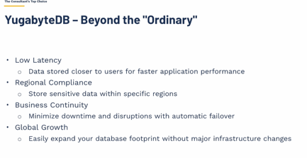
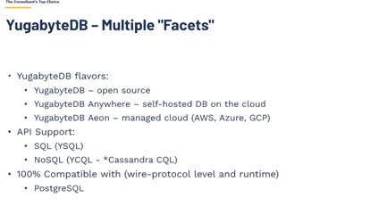
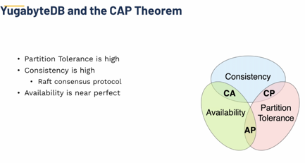
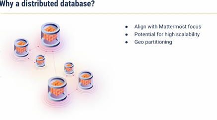
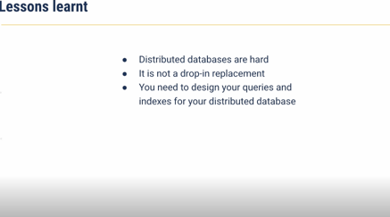
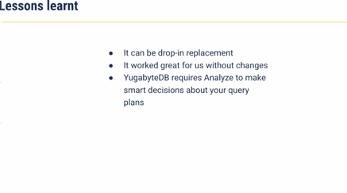
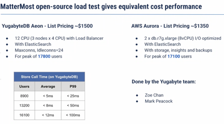

* Increase data volume and velocity
* real time data processing and visualizations
* high avail and DR

## What are the architectural paradigms for cloud centric DBs

## how to decide which db to be used?

2nd talk

##  why distributed dbs are required

## load test with yugabytes 

