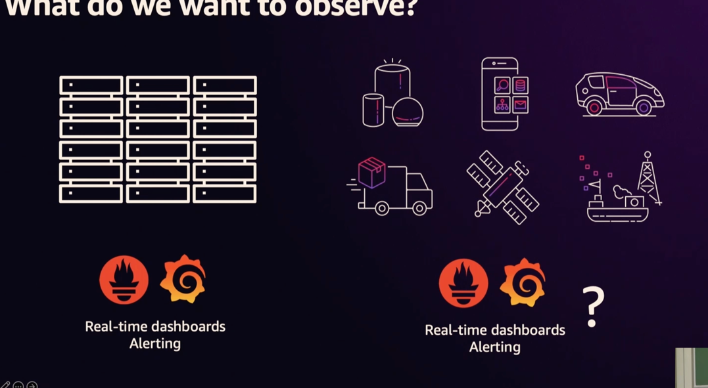
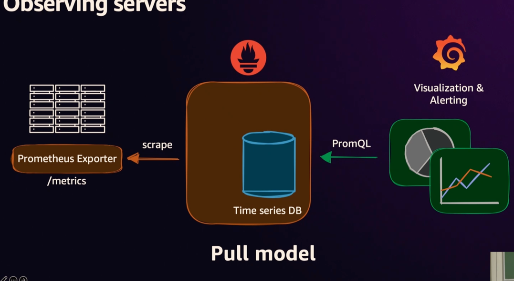
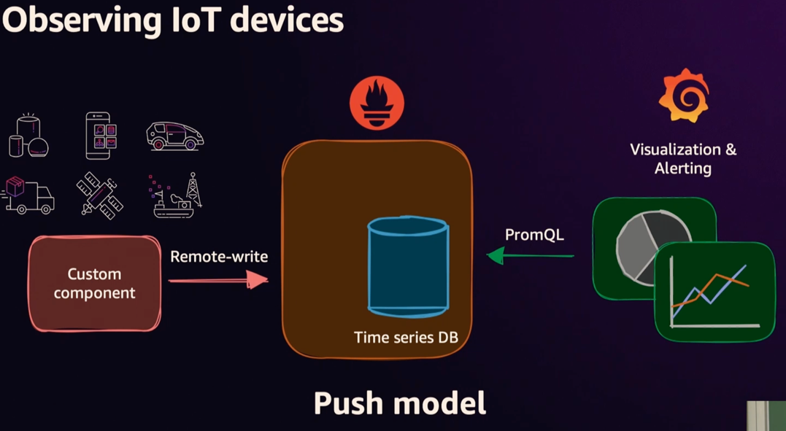
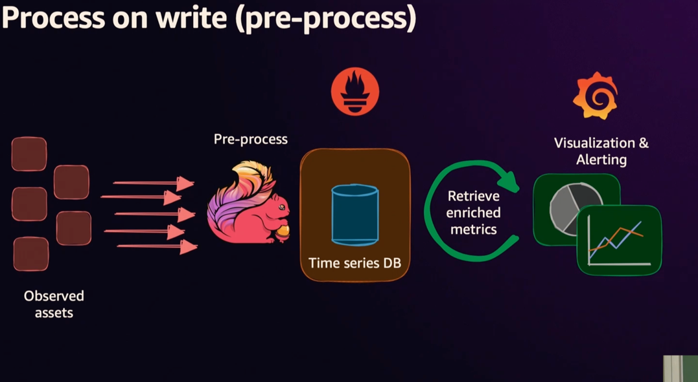
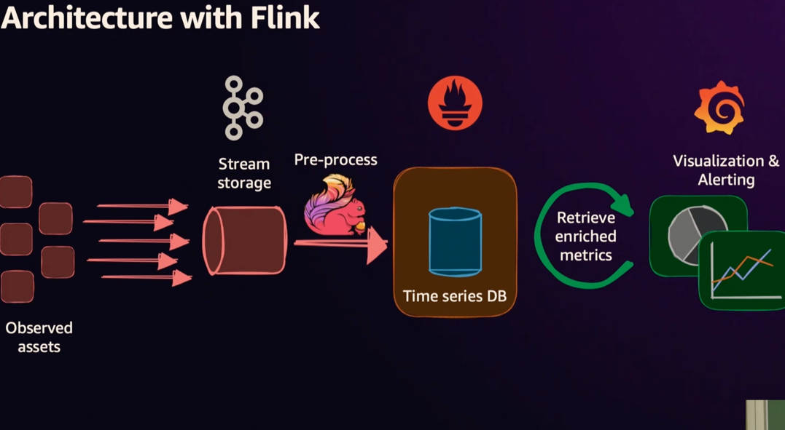
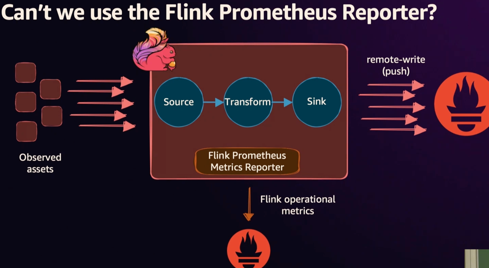

# Flink and Prometheus

Pull model

Push model

## PromQL

Flink
* checkpointing
* safepointing
* Stateful computation
* unbounded and bounded data streams

## high cardinality and high metrics

## how these can be used in iot project?

## How flink supports exactly once read?
Is it needs to be done after the data push to prometheus or after read from Kafka?

## how flink can be scaled in case of IOT. Whether it should be done with K8s?

## why jvm based language is often suggest with flink and not pyflink?

## flink Prometheus connector
* released in Nov 2024

## can flink supports the iceberg as delta lake architecture

git repo for connected devices with flink and prometheus

### how to do backfill or replay the records frm kafka with flink?

