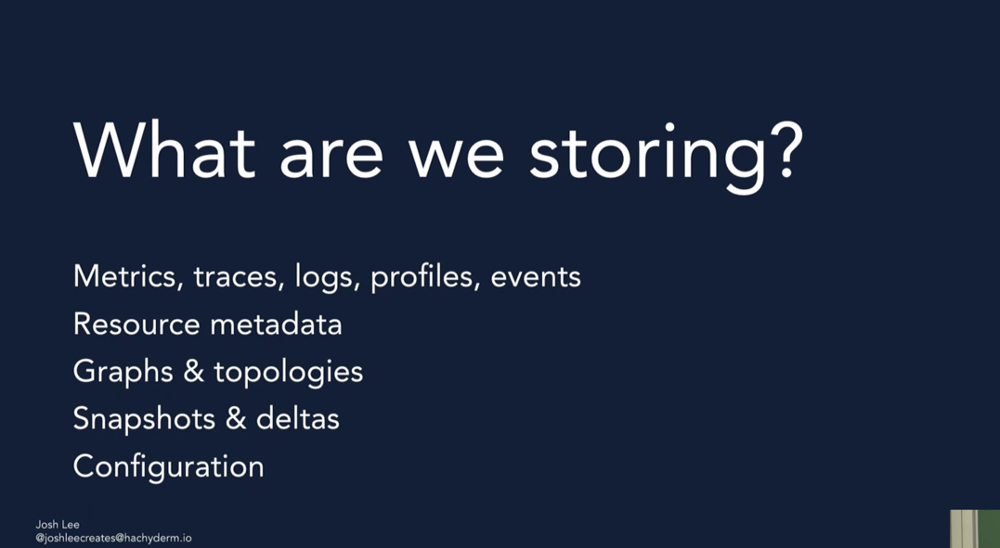
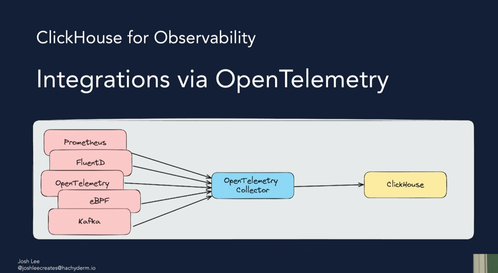
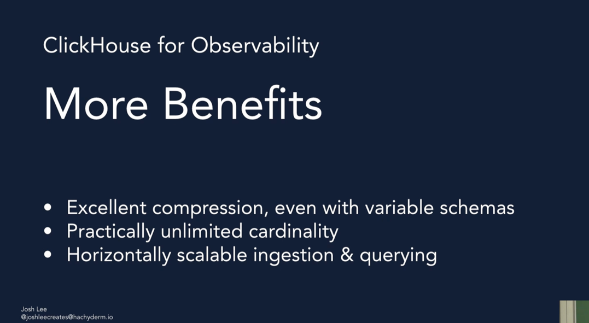
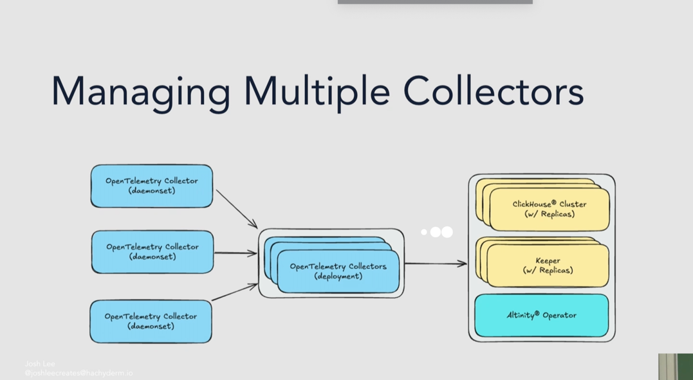

# Exploring a Unified Telemetry Database- clickhouse

Telemetry is WORM( write once, read many)

1. What Otel can collect?
* trace
* logs
* metrics

#what is biong stored in ch

## How the ch scale with petabytes of data

## clickhouse for observability
based on the LSM-B_trees architecture.

## Data transformation and mgmt
* M views
* TTL
* Tiered storage

Can be integrated with the grafana.
Also, with Kafka table

what does the below points means?

promQL can be used
# What is promQL?
* is it ok to use SQL or PromQL is really required?

# scaling

