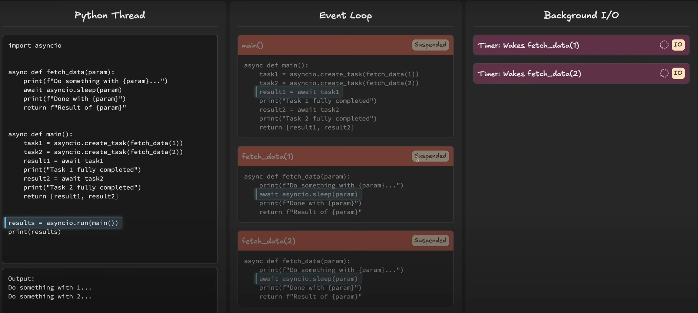
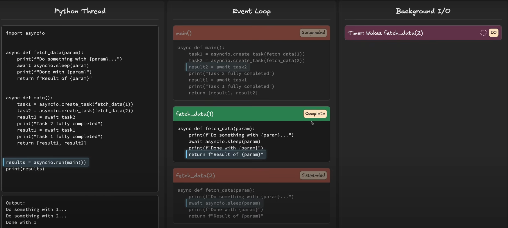

so in the case of asyncio, when I do asyncio.run(main()). this statement starts an event loop. This can be termed as a scheduler to start the tasks.


## why it is not time.sleep() and await.sleep()
in case of the time.sleep()-> the entire program is put on sleep and also the event loop.
During this time, no other tasks can run, which defeats the purpose of using asyncio.

But in case of asyncio.sleep(), the task yeilds control back to the event loop.

time.sleep() in synchronous code.
await asyncio.sleep() in asynchronous code.


Technically, `await asyncio.sleep(5)` executes `await asyncio.sleep(5).__await__()` in the background.

## await

The `await` keyword is used to pause the execution of an async function until the awaited task is complete.
### Rule of thumb

1. Code after an await → waits until that awaited task finishes before running.
2. Other tasks in the event loop → can continue running while your task is paused at the await.

## Task and coroutines in asyncio
in my learning, dont use await with the subroutine directly, instead use create_task to put the subroutine in the event loop and then await it.

```angular2html
    ## the below os the correct way to do it. 
    ## create_task puts the coroutine in the event loop and starts executing it.
    download_task = asyncio.create_task(download_file())
    log_task = asyncio.create_task(log_activity())

    ## this is wrong way to do it.
    # download_task =download_file()
    # log_task = log_activity()

    await log_task
    normal()

    await download_task
```
In the first case, the tasks are scheduled to run in the event loop immediately. 
In the second case, the await will put the subroutine in the event loop only when it is awaited, which means the tasks will run sequentially.


1. The main is suspended becaise of await task(1)
2. However, the event loop is not suspended, it can run other tasks.
3. So the event loop can switch to task(2) and run it.
4. Once task(1) is done, the main resumes right after the await.


## lets change the order of await


now even though the task1 is completed first, the main will wait for task2 to complete before resuming.


🎯 Quick cheat sheet

One task, run to completion → await coro

Start and forget (background) → create_task

Many tasks, need all results → gather

Many tasks, handle as they finish → as_completed

Many tasks, custom completion logic → wait


## Taskgroup in Python 3.11


## class based implementations
```angular2html
import asyncio


class MyAwaitable:
    def __init__(self, delay, value):
        self.delay = delay
        self.value = value

    def describe(self):
        """Regular method: just prints what this awaitable is about."""
        print(f"MyAwaitable: will wait {self.delay}s and return {self.value}")

    def __await__(self):
        """Makes this object awaitable with `await`."""
        print("Starting await")
        # Delegate to asyncio.sleep() to simulate async waiting
        yield from asyncio.sleep(self.delay).__await__()
        print("Finished await")
        return self.value

    async def run(self):
        """Async method that uses the awaitable behavior."""
        result = await self
        print(f"run() got result: {result}")
        return result


async def main():
    # Create an instance
    obj = MyAwaitable(2, 99)

    # Call a regular method
    obj.describe()

    # Await directly
    result = await obj
    print("Direct await result:", result)

    # Or call its async helper
    run_result = await obj.run()
    print("Async run() result:", run_result)


asyncio.run(main())
```


