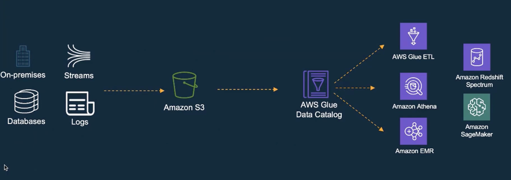

The below picture depicts the how the data lake is built in the past.
1. All the raw data can be captured via multiple sources and landed to the s3 buckets.
2. GLue crawlers can be run to register the table and add new partitions.
3. ETL can be run via glue to process the data anf pushed to new s3 buckets.
4. Any raw or curated data can be used via athena or redshift or sagemaker

**What I see the major problem is how to manage the security of data in s3.**

AND

**How to have row level access on the data.**

# What is a lake formation
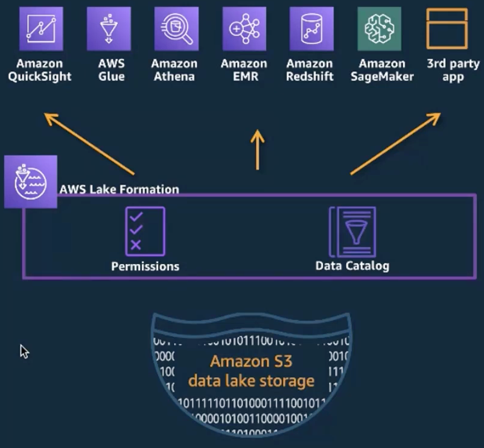

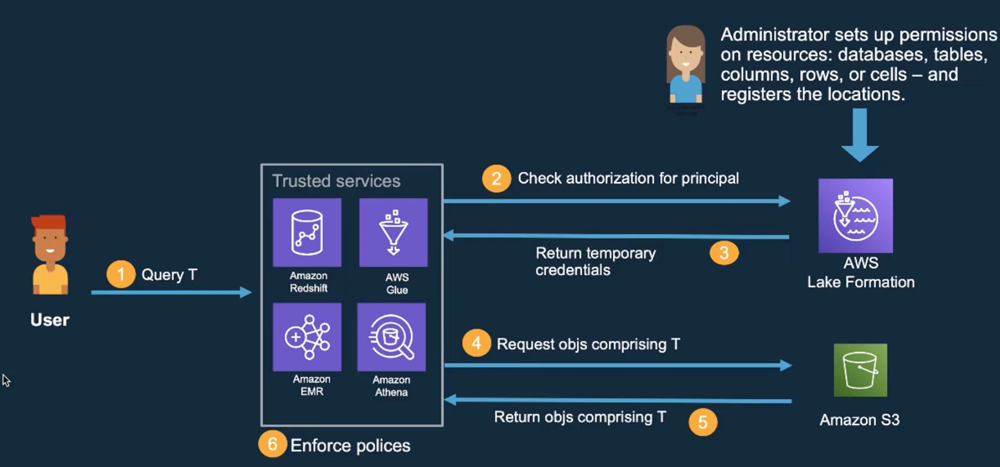

The above picture depicts the workflow on how the query result will be returned to the user
1. When user fire a query via any of the tool/service- LF check the authorization of for the principal
2. Once it passed, a temp credentials are returned
3. the underlying data will be access in s3
4. Enforce the LF policies before returning back the results.

# LF can be used to provide access to various level
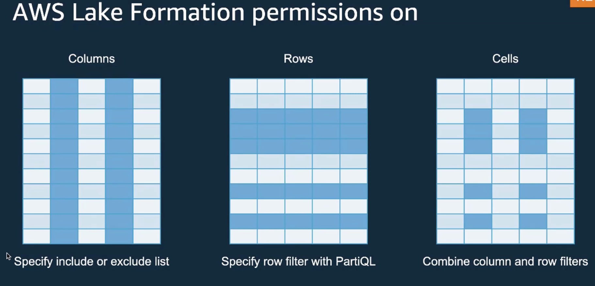

## Columns level permission

## Row level permissions

## cell level permissions

# what does this mean- IAM for coarse grained access and LF for fine-grained permission

# What is tag based access control(LF-TBAC)

# how it is a part of modern lake architecture on aws?

# what "import awswrangler as wr"

# POC steps to provide access via LF to table created via lake formation
## Non s3Backed table

1. I have 3 users- neptune_user, neptune_analyst, neptune_developer created via IAM
2. Now I have logged in via LF admin user not via root user
3. create a database in lake formation
4. create a table in the database via lake formation console
5. go to lf -> permissions-> LF-Tags and permissions
6. created tag key- "sensitivity" and tag values- "public", "private", "protected"
7. attached the tags to the columns while creating the table
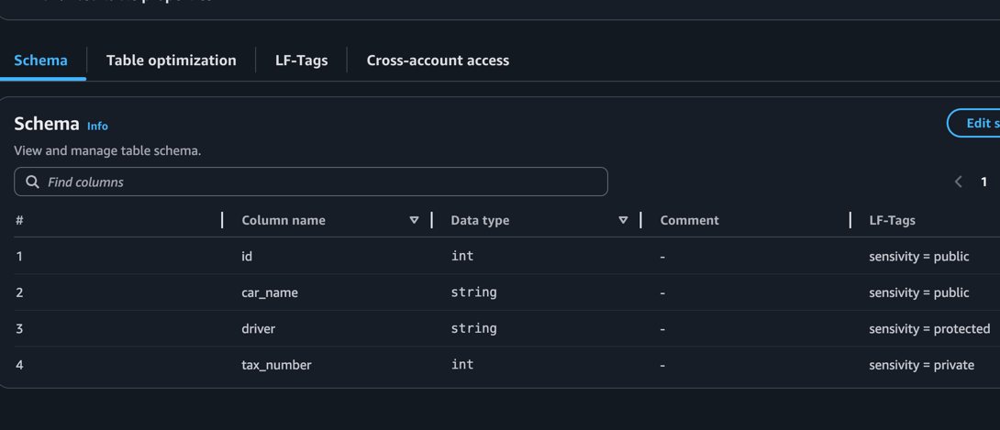
7. **AS OF NOW NO USER HAS ANY ACCESS TO THE TABLE as the table is created via LF and tagged is added**
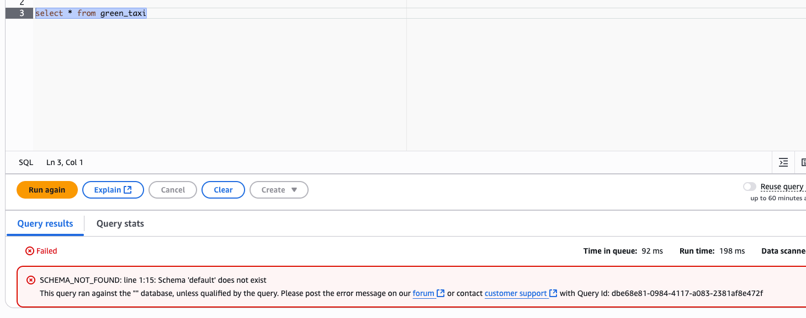

| Layer                  | Purpose                                             | Example                                               |
|------------------------| --------------------------------------------------- | ----------------------------------------------------- |
| **Data permissions**   | Control **who can access data** (read/write)        | “Analyst can SELECT from `sales.orders`”              |
| **LF-Tag permissions** | Control **who can create, assign, and manage tags** | “DataSteward can assign tag `domain=sales` to tables” |
 
**LF-Tag–based data permissions are the modern, preferred way to manage access at scale.**

## Now I need to provide access to the users via Data permissions via Tags
1. In the data permissions tab, I have provided neptune_user user the select access with tag as public
2. 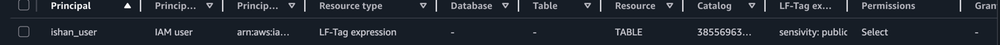
3. Nw, when I logged in via neptune_user- I can see the table and can run the select query
4. 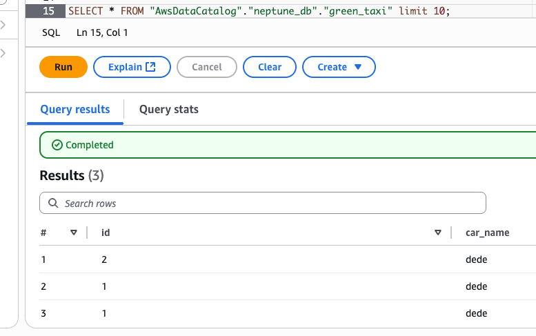
5. Lets change the tag to private
6. 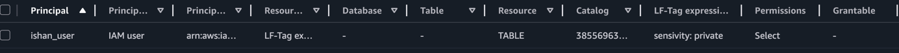
**I can see the only private tagged column**
7. 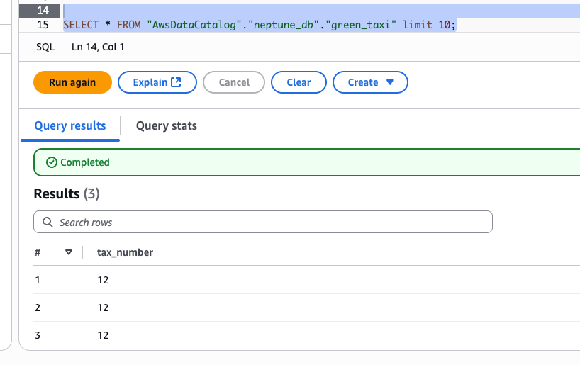
8. Lets change tag to protected
9. 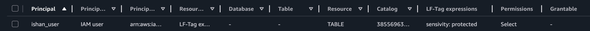
10. I can see only protected tagged column
11. 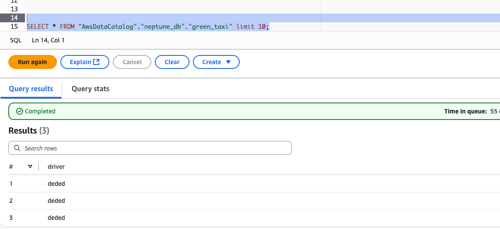
12. Lets add another grant with all the 3 tags
13. 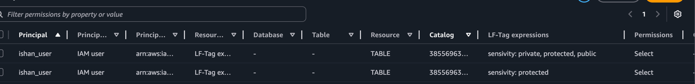
14. Now, I can see all the columns
15. 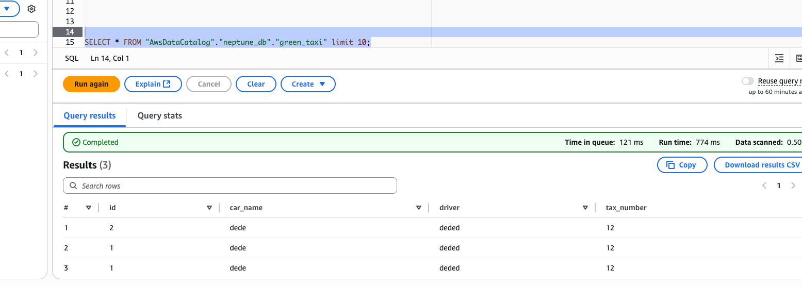

## Provide access to LF-Tag permissions under LF-Tags and Privileges tab

##  s3Backed table