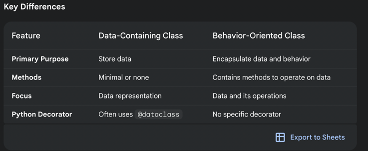

1. Data containing classes vs behaviour classes

The data containing classes are the classes that primarily focuses to store data and provide a convinient way to represent the structural information
Characteristics:
a. Often have minimal or no methods (functions) defined within them.
b. Primarily rely on attributes (variables) to hold data.
c. Often use the @dataclass decorator in Python for concise creation.


In case of behavior oriented classes, it encapsulates both data and the operations that can be performed on the data.
Characteristics:
a. Contain a combination of attributes and methods.
b. Methods define the behavior and actions that can be performed on the class's objects





## **Key concepts**

1. Defining  the data classes with primitive types
```
@dataclass
class PersonWithPrimitiveDefaultVal:
    name: str  # if the datatype is not defined then we will get the error
    age: int = 13


def _person_with_default_val():
    p1 = PersonWithPrimitiveDefaultVal('John')
    print(p1)  # Person(name='John', age='12')

    p2 = PersonWithPrimitiveDefaultVal('Ishan')
    print(p2)
```
2. Defining the dataclasses with the default values
```
@dataclass
class PersonWithPrimitiveDefaultVal:
    name: str  # if the datatype is not defined then we will get the error
    age: int = 13


def _person_with_default_val():
    p1 = PersonWithPrimitiveDefaultVal('John')
    print(p1)  # Person(name='John', age='12')

    p2 = PersonWithPrimitiveDefaultVal('Ishan')
    print(p2)
```
3. frozen the dataclasses
```
@dataclass(frozen=True)
class PersonFrozen:
    name: str
    age: int


def _frozen_example():
    p1 = PersonFrozen('p1',13)
    print(p1)
    # p1.age=12  #this will throw an error
```
4. check the repr and other `Dunder` methods
```aiignore
@dataclass
class PersonWithPrimitiveDefaultVal:
    name: str  # if the datatype is not defined then we will get the error
    age: int = 13


def _person_with_default_val():
    p1 = PersonWithPrimitiveDefaultVal('John')
    print(p1)  # Person(name='John', age='12')

    p2 = PersonWithPrimitiveDefaultVal('Ishan')
    print(p2)

    print(p1.__dict__) #{'name': 'John', 'age': 13}
    print(p1.__repr__()) #PersonWithPrimitiveDefaultVal(name='John', age=13)
    print(p1.__dir__())
    print(p1.__annotations__) #{'name': <class 'str'>, 'age': <class 'int'>}
    print(p1.__eq__(p2)) #False is the attribute values are equals for both p1 and p2
```
5. Set the default values for the non-primitive type with `field` keyword
```
@dataclass
class PersonWithComplexDefaultVal:
    name: str
    age: int
    email_address: list[str]=[] #this will throw and error 
   ```

```
@dataclass
class PersonWithComplexDefaultVal:
    name: str
    age: int
    email_address: list[str]=field(default_factory=list)


def _person_with_complex_default_val():
    p1 = PersonWithComplexDefaultVal('p1', 13)
    print(p1)  PersonWithComplexDefaultVal(name='p1', age=13, email_address=[]) The email_address is empty
```

```

def generate_list() -> list[int]:
    return [1, 2, 3]

@dataclass
class PersonWithComplexDefaultVal:
    name: str
    age: int
    email_address: list[str] = field(default_factory=list)
    custom_generated_variable: list[int] = field(default_factory=generate_list)


def _person_with_complex_default_val():
    p1 = PersonWithComplexDefaultVal('p1', 13)
    print(p1)

```

6. Dataclasses with the init set to false
```
   
@dataclass(frozen=True, kw_only=True)
class PersonWithComplexDefaultVal:
    name: str
    age: int
    email_address: list[str] = field(default_factory=list)
    custom_generated_variable: list[int] = field(default_factory=generate_list)
    making_init_false: list[int] = field(init=False, default_factory=generate_list) #in this case the I cnnot assign the value to this vaiable


def _person_with_complex_default_val():
    p1 = PersonWithComplexDefaultVal(name='p1', age=13, email_address=['ishan'])
    print(p1)
    p2 = PersonWithComplexDefaultVal(name='p3', age=13, email_address=['ishan'],
                                     custom_generated_variable=[101, 9109, 2, 3])
    print(p2)
    p3 = PersonWithComplexDefaultVal(name='p3', age=13, email_address=['ishan'], making_init_false=[22, 2])  ##this will throw an error
    print(p3)

```

7. kw_only
```
@dataclass(kw_only=True)
class PersonWithKW:
    name: str
    age: int

def _kw_only_example():
    # p2 = PersonWithKW('p3',123) this will throw an error
    p2 = PersonWithKW(name='p3', age=123) #need to provide the name= and age= 
    print(p2)
```
8. match_only