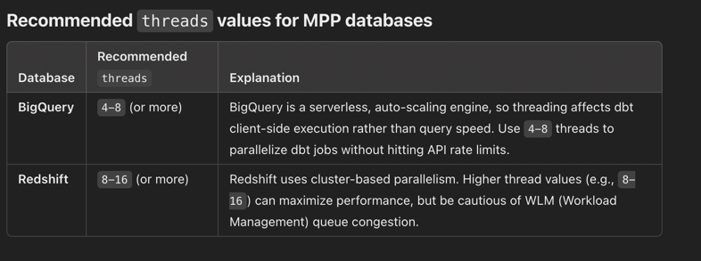
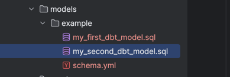
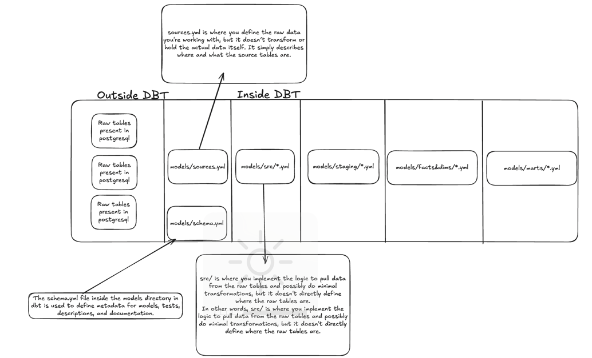

## local setup

1. Install adapter for postgres
   pip install dbt-postgres

2. install dbt-core
   pip install dbt-core

3. dbt init
   this command will initialize the dbt with the available postgres plugin

```
dbt init
20:19:36  Running with dbt=1.9.2
20:19:36  [ConfigFolderDirectory]: Unable to parse logging event dictionary. Failed to parse dir field: expected string or bytes-like object.. Dictionary: {'dir': PosixPath('/Users/ishan.kumar/.dbt')}
20:19:36  Creating dbt configuration folder at 
Enter a name for your project (letters, digits, underscore): learning_project
20:19:50  
Your new dbt project "learning_project" was created!

For more information on how to configure the profiles.yml file,
please consult the dbt documentation here:

  https://docs.getdbt.com/docs/configure-your-profile

One more thing:

Need help? Don't hesitate to reach out to us via GitHub issues or on Slack:

  https://community.getdbt.com/

Happy modeling!

20:19:50  Setting up your profile.
Which database would you like to use?
[1] postgres

(Don't see the one you want? https://docs.getdbt.com/docs/available-adapters)

Enter a number: 1
host (hostname for the instance): localhost
port [5432]: 
user (dev username): admin
pass (dev password): 
dbname (default database that dbt will build objects in): dbt_learning
schema (default schema that dbt will build objects in): dbt_learning
threads (1 or more) [1]: 2
20:20:42  Profile learning_project written to /Users/ishan.kumar/.dbt/profiles.yml using target's profile_template.yml and your supplied values. Run 'dbt debug' to validate the connection.
➜  learning_dbt git:(main) ✗ ls -lrt
total 8
-rw-r--r--   1 ishan.kumar  staff  120 Mar  5 21:12 README.md
drwxr-xr-x  11 ishan.kumar  staff  352 Mar  5 21:18 learning_project
drwxr-xr-x   3 ishan.kumar  staff   96 Mar  5 21:19 logs
➜  learning_dbt git:(main) ✗ pwd  
/Users/ishan.kumar/PycharmProjects/learning_project/learning_dbt
➜  learning_dbt git:(main) ✗ cd learning_project 
➜  learning_project git:(main) ✗ ls -lrt
total 16
-rw-r--r--  1 ishan.kumar  staff   571 Mar  5 21:18 README.md
drwxr-xr-x  3 ishan.kumar  staff    96 Mar  5 21:18 analyses
drwxr-xr-x  3 ishan.kumar  staff    96 Mar  5 21:18 macros
drwxr-xr-x  3 ishan.kumar  staff    96 Mar  5 21:18 models
drwxr-xr-x  3 ishan.kumar  staff    96 Mar  5 21:18 seeds
drwxr-xr-x  3 ishan.kumar  staff    96 Mar  5 21:18 snapshots
drwxr-xr-x  3 ishan.kumar  staff    96 Mar  5 21:18 tests
-rw-r--r--  1 ishan.kumar  staff  1262 Mar  5 21:19 dbt_project.yml
```
**above is the project directory created in after the dbt init command**


## Apart from the above files and directories, `dbt init` command also created, `.dbt` folder will also be created in the laptop

```
➜  learning_project git:(main) ✗ cd 
➜  ~ cd .dbt 
➜  .dbt ls -lrt
total 8
-rw-r--r--  1 ishan.kumar  staff  219 Mar  5 21:20 profiles.yml
➜  .dbt cat profiles.yml 
learning_project:
  outputs:
    dev:
      dbname: dbt_learning
      host: localhost
      pass: ***
      port: 5432
      schema: dbt_learning
      threads: 2
      type: postgres
      user: admin
  target: dev
➜  .dbt 
```
4. **thread** specifies the defines the number of concurrent database connections 
    that dbt can use when running models in parallel. 
5. Now what should be the value for bq or redshift which support mpp analytics computations?
   When using BigQuery (BQ) or Redshift, which are Massively Parallel Processing (MPP) databases, the optimal value for threads depends on the workload, 
   concurrency limits, and warehouse size. Here’s how to decide:



Please note it will also create some model files



# What is CTE(Common table expression)?


# core concepts



## What is the schema.yml used for?

## creating the sources 

## creating the models


