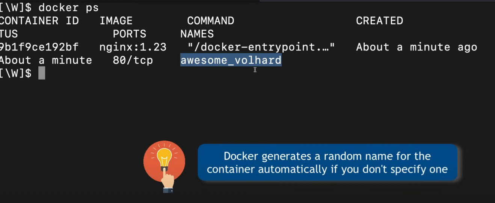
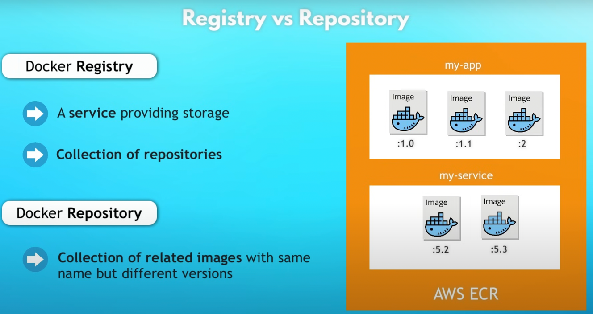
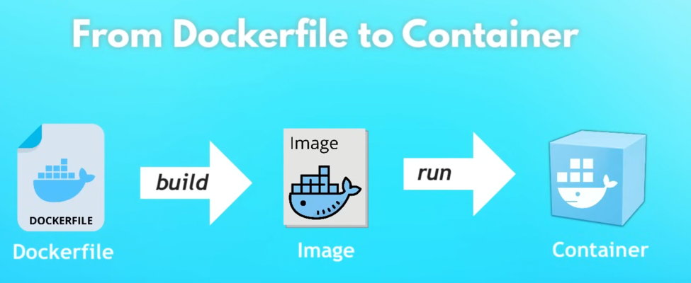
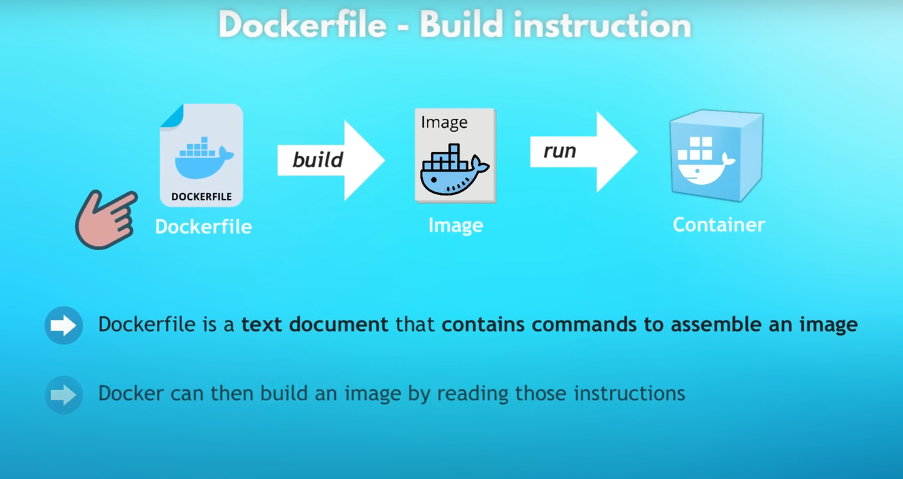
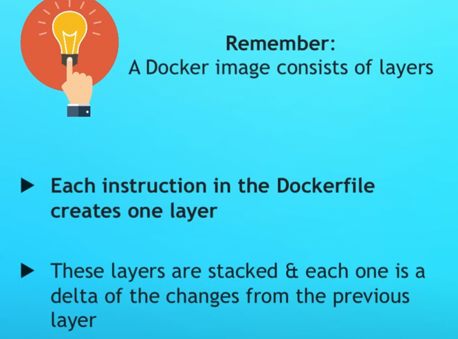
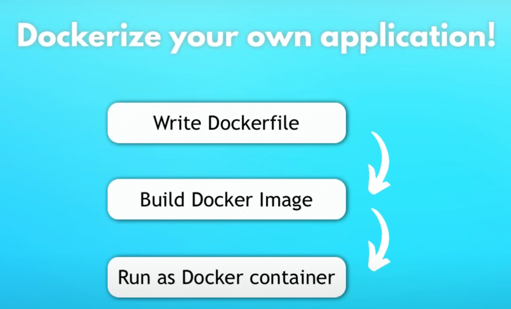
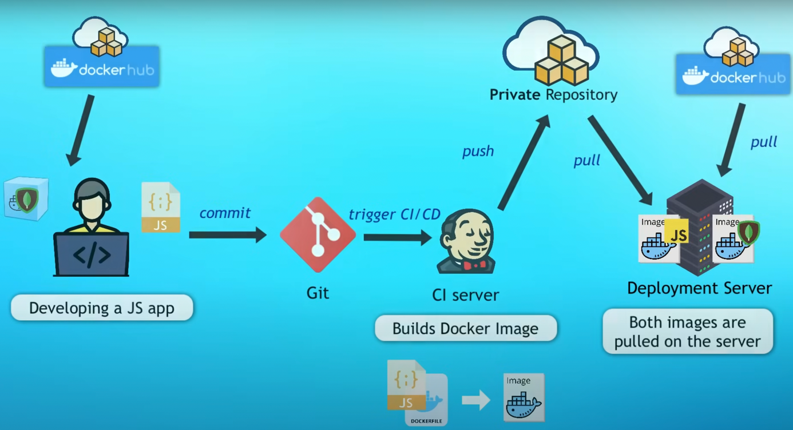
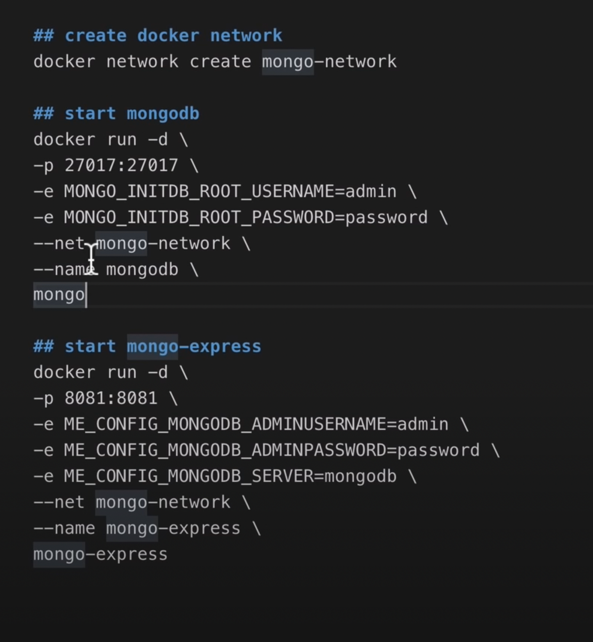
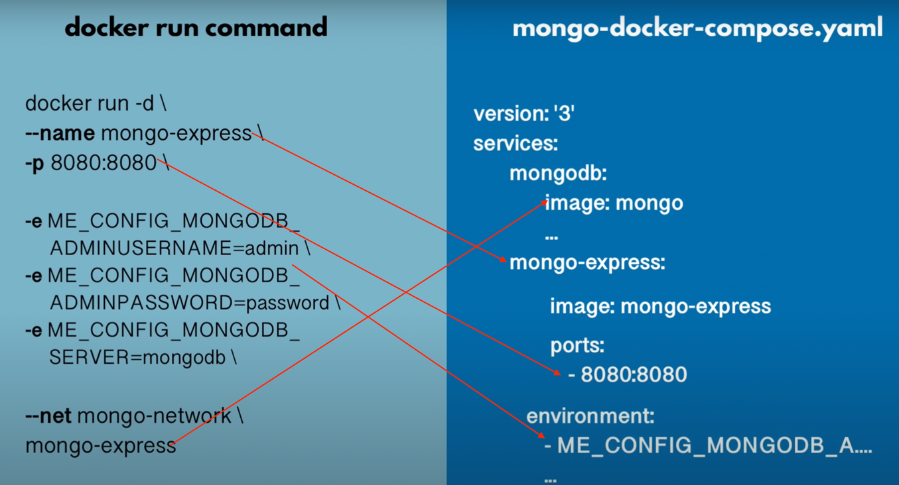
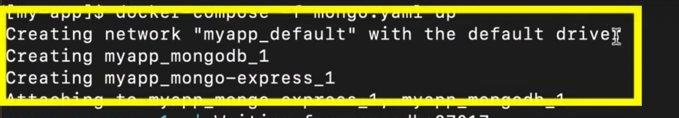

https://www.youtube.com/watch?v=XQNv0SRB0OM&t=2186s

# Another good tutorial

https://www.youtube.com/watch?v=pg19Z8LL06w


1. Create a docker image with the Dockerfile
   docker build -t 1st-image:latest .

2. View all the images
   docker images      
   REPOSITORY TAG IMAGE ID CREATED SIZE
   1st-image latest c61da6d927d8 38 seconds ago 851MB
   ishan-airflow latest 1b4c81c1ea72 2 hours ago 1.61GB
   <none>          <none>         8597dda44736 3 hours ago 1.6GB
   postgres 13 a23178a3ff53 7 days ago 444MB
   redis 7.2-bookworm 7abeccc3a770 7 weeks ago 139MB
   
3. Run the docker image which is created just now
   docker run -d -it 1st-image

   docker ps
   CONTAINER ID IMAGE COMMAND CREATED STATUS PORTS NAMES
   6b52cbe2278d 1st-image   "python3"   12 seconds ago Up 11 seconds festive_elion

4. Run the docker with volumne
   docker run -d -it -v testVolumn:/data 1st-image bash
   **However this is not persistent and file will be removed once container is killed**

5. docker run -d -it -v /Users/ishan.kumar/PycharmProjects/learning_project/learning_docker/first_step:/data 1st-image
   bash
   **This command will run the docker containers with the path **_mounted_****


6. to kill all the running containers,
   docker kill $(docker ps -q)


7. Time to create our own images

8. docker run with port mapping
   docker run -d -p 8080:8080 image_name

`-d or --detach  is an option to run the docker container in background. It outputs the continerid after start`

9. docker pull ngnix:1.23 - this will pull the docker image to my mac
   

10. What is docker start and stop
    docker stop command is to stop the running container.
    **Use docker start when restarting an already created container.**

11. docker volume ls
    **to list all volume**
    DRIVER VOLUME NAME
    local airflow-docker_postgres-db-volume
    local airflow-ingest_db_data
    local airflow_2_postgres-db-volume
    local airflow_210_postgres-db-volume
    local airflow_242_postgres-db-volume
    local airflow_270_postgres-db-volume


12. Pull nginx image and run the with the port on 9000
    docker pull nginx:1.27.4
    docker run -d -p 9090:80 nginx:1.27.4
13. docker logs 327dee0fdf01
    this command will show the logs of a container. 327dee0fdf01 is the container id.


14.
```docker run -d  --name mysql-container_1 -e MYSQL_ROOT_PASSWORD=my-secret-pw -e MYSQL_DATABASE=my-database -e MYSQL_USER=my-user -e MYSQL_PASSWORD=my-password -p 3306:3306 mysql:latest```
Above command will start the docker with mysql image. Binded with port 3306.
However its better to attach the volume with this.

**docker run command always creates a new container. Its better to rerun the previous created container. we can check that by running `docker ps -a`**


15. docker ps -a
    this command will list all the containers **including stopped ones**
16. always provide --name args while running the docker run command.




17. Dockerfile 
    it is the place where I can defined base images followed by commands to create a custom image
```
FROM node:19-alpine

USER root

COPY src /app/

COPY abc.json /app/

WORKDIR /app

CMD  ["node","server.js"]

```
### lets break the above line by line

a. FROM node:19-alpine
    The base image to choose to build my custom image. Here I can choose python or simple linux
    `alpine` is the lightweight linux distribution


b.  USER root 
    Switching the user to root


c. COPY src /app/
    copy src folder from my local to /app folder. It will create the folder if nit present


d. COPY abc.json /app/
    copy abd.json file to /app folder during building the image.


e. WORKDIR /app
    change to /app dir. same like `cd /app`


f. CMD  ["node","server.js"]
   run command inside the docker container.






**I NEED TO BUILD THE DOCKER IMAGE WITH THIS Dockerfile which is a next command**

18. docker build -t custom-iamge-node:1.0 .


    build is the command
    -t is the tag flag
    custom-iamge-node:1.0  is image-name with version number





19. **how to use docker in real world use case**


20. docker compose

  Now I know how tu run multiple docker containers using docker run command.
 But lets say I need multiple containers for my application to run. Now everytime I need to run all the 10 containers manually. 
  Here the docker compose file shines.
  In simple terms, docker compose file is a set of all the docker runs commands.

The below image depicts all the commands that are required to run for my application




**DOCKER COMPOSE TAKE CARE OF CREATING A COMMON NETWORK FOR ALL THE CONTAINERS** 

Here in the logs its mentioned that docker compose is creating network

21. docker network ls
    here we can see the networks
```
➜  airflow_2.10 docker network ls
NETWORK ID     NAME                  DRIVER    SCOPE
3213a56f593d   airflow_270_default   bridge    local
f91a41877f81   bridge                bridge    local
9c59ae79032a   host                  host      local
75c6acda865a   none                  null      local
7da25e5d13d5   postgresql_default    bridge    local
```

A running instance of an image is called as container. Once image can be run on multiple containers to
increase the performance of an application.


things to read
https://medium.com/apache-airflow/what-we-learned-after-running-airflow-on-kubernetes-for-2-years-0537b157acfd

