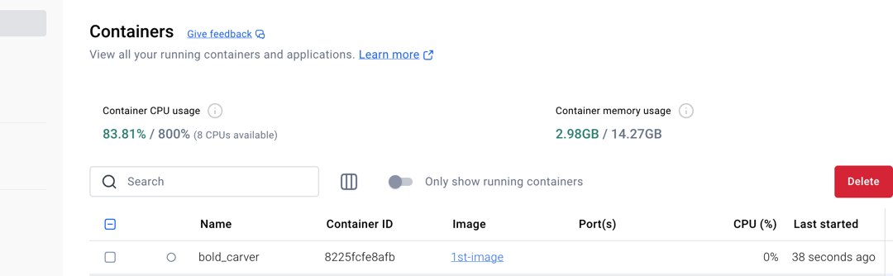

1. Create a docker image with the Dockerfile
   docker build -t 1st-image:latest .

2. View all the images
   docker images      
   REPOSITORY TAG IMAGE ID CREATED SIZE
   1st-image latest c61da6d927d8 38 seconds ago 851MB
   ishan-airflow latest 1b4c81c1ea72 2 hours ago 1.61GB
   <none>          <none>         8597dda44736 3 hours ago 1.6GB
   postgres 13 a23178a3ff53 7 days ago 444MB
   redis 7.2-bookworm 7abeccc3a770 7 weeks ago 139MB
 
3. Run the docker image which is created just now
    docker run -d -it  1st-image 

    docker ps
CONTAINER ID   IMAGE       COMMAND     CREATED          STATUS          PORTS     NAMES
6b52cbe2278d   1st-image   "python3"   12 seconds ago   Up 11 seconds             festive_elion

4. Run the docker with volumne
   docker run -d -it  -v testVolumn:/data  1st-image bash
   **However this is not persistent and file will be removed once container is killed**

5. docker run -d -it  -v /Users/ishan.kumar/PycharmProjects/learning_project/learning_docker/first_step:/data  1st-image bash
    **This command will run the docker containers with the path **_mounted_****
     

6. to kill all the running containers, 
   docker kill $(docker ps -q)

7. Time to create our own images

