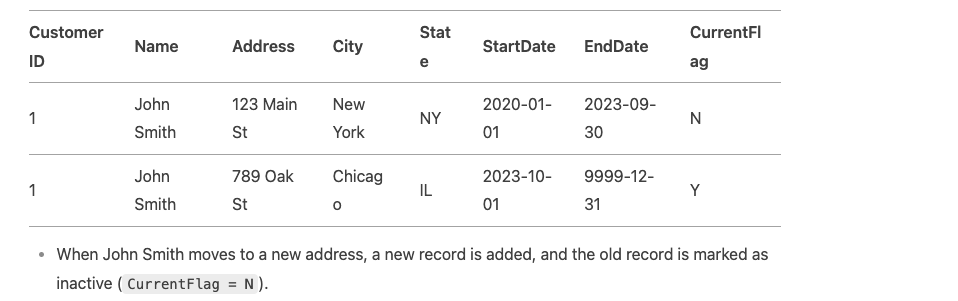

1. What is File pruning?

File pruning is the process of **skipping unnecessary data during query execution by leveraging file metadata,
like partition keys or clustering information.** This helps queries run faster by reducing the amount of data scanned.

2. Broadcast joins
   These join are very similar to the spark bc join where a table is less than 10 mb is saved locally on all the nides of the cluster. Both redshift and bq do this broadcast jon by default.

3. Bucket join
A bucket join works by pre-partitioning the data into smaller, manageable chunks called buckets based on a hash function applied to the join key. 
When performing a join, only the corresponding buckets from each table are compared, reducing the amount of data that needs to be shuffled across the network.

*  In the case of redshift, the bucket join is done via a distribution key and sort key.
*  In the case of BQ, this  can be achived similar benefits by using clustering and partitioning on the join keys

4. Hash Join
   In this case a hashing can be done on the keys which are required as join keys. for example creating hashing for string based keys.

## SCD TYPES

1. SCD TYPE 0
   Here the change in the source does not impact anything on the deh tables. I mean on the dims table. For example the change in the fax number of a customer which is not relevant in the dwh.
2. SCD TYPE 1
Only maintain the latest record in the dims table. 
3. SCD TYPE 2(**MOST COMMON USED IN DWH**)
This is an append-only kind of solution. Here a flag is maintained with start_date and end_date. 

* flag is used to identify whether the record is the latest record. The column type is generally set to boolean.
* start_date have with 1970 for initial record, and this can be changed when the record needs to be updated.
* end_date have with 9999 for initial record, and this can be changed when the record needs to be updated.

4. There are the other SCD types but type2 is commonly used.

## Dimensional modelling
it simply mean facts and dims

## OBT
It simply means one big table to have less joins

* Use OBT in a data lake for raw, denormalized data storage.

* Use dimensional modeling in a data warehouse for structured, curated data.

* Use dimensional modeling for historical data that requires tracking changes (e.g., SCD Type 2).

* Use OBT for real-time or near-real-time data that requires fast access.

## How to Combine OBT and Dimensional Modeling?

* Raw Layer (OBT): Store raw, denormalized data in a data lake or staging area.

* Curated Layer (Dimensional Modeling): Transform the raw data into a structured, dimensional model for analytical purposes.

* Presentation Layer (OBT): Create denormalized, pre-joined tables (OBT) for specific use cases like reporting or dashboards.

## surrogate keys
A surrogate key is a unique identifier assigned to each record in a database table, typically used in data warehousing and dimensional modeling. It is an artificial or synthetic key that has no business meaning and is not derived from the data itself. Instead, it is generated solely for the purpose of uniquely identifying rows in a table.