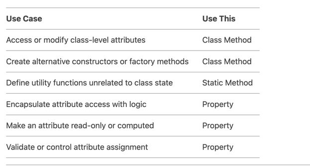
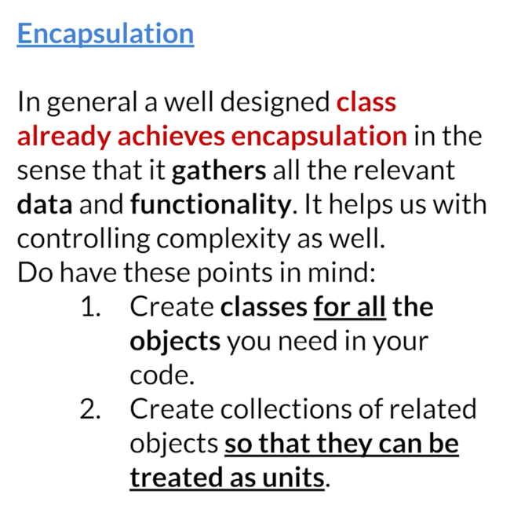
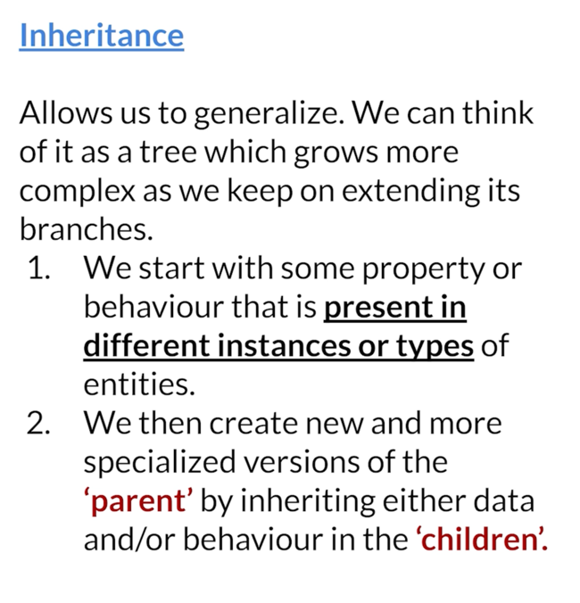
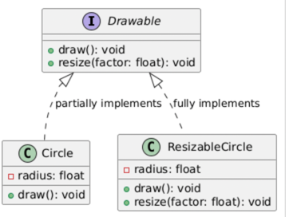

1. What is the use of assertion in Python?

When creating an object, you can use assert to ensure that the parameters passed to the constructor 
meet the required conditions.
```
class Person:
    def __init__(self, name, age):
        assert isinstance(name, str), "Name must be a string"
        assert age > 0, "Age must be positive"
        self.name = name
        self.age = age

# Example Usage
p1 = Person("Alice", 30)  # Works
p2 = Person("Bob", -5)    # Raises AssertionError: Age must be positive
```
2. class level attribute  inside the class

3. class method

Scenario: I have a class which represents an Item. Now the requirement is to read the file and create the object by reading line by line.
**Here the class method can be used.**


Factory Methods can be defined using class method

Class methods are often used to create alternative constructors for a class. They allow the creation of objects in different ways than the standard __init__ constructor.

```
class Person:
    def __init__(self, name, age):
        self.name = name
        self.age = age

    @classmethod
    def from_string(cls, person_string):
        name, age = person_string.split(',')
        return cls(name, int(age))

person = Person.from_string("Alice,30")
print(person.name)  # Alice
print(person.age)   # 30
```

Singleton Pattern Implementation

Class methods can help implement the singleton pattern by ensuring only one instance of a class is created.

```
class Singleton:
    _instance = None

    @classmethod
    def get_instance(cls):
        if cls._instance is None:
            cls._instance = cls()
        return cls._instance

obj1 = Singleton.get_instance()
obj2 = Singleton.get_instance()
print(obj1 is obj2)  # True
```
question: why cls is the first param in the class method?


Answer- Because its being called by the class like `Person.from_string`. When the method is called by the onject like below
```angular2html
class Person:
    def some_method(self)

p=Person()
p.some_method
```
**In the above self is the first param in the method and in case of the class method it will be the cls as a param.**

4. static method

**In general, static methods are ideal for utility functions or logic that doesn't require access to either instance-level (self) or class-level (cls) data.**

```angular2html
class ApiOperator(BaseOperator):
    @staticmethod
    def handle_api_response(response):
        if response.status_code != 200:
            raise Exception(f"API call failed: {response.text}")
        return response.json()

class AnotherApiOperator(BaseOperator):
    def execute(self, context):
        response = call_some_api()
        data = ApiOperator.handle_api_response(response)
        self.log.info(f"Received data: {data}")

```
* Keeps utility functions logically grouped within the operator's scope.
* If you don't need access to the attributes or methods of the class or instance, a @staticmethod is better than a @classmethod or instance method. That way it is clear (from the @staticmethod decorator) that the class' and instance's state is not read or modified. However, using a function makes that distinction even clearer.

For example in the below
```angular2html
class Product:
    tax_rate = 0.1  # Class-level attribute
    
    def __init__(self, name, price):
        self.name = name
        self.price = price
    
    @staticmethod
    def calculate_discount(price, discount_percentage):
        """
        Calculate the discounted price given a price and discount percentage.
        """
        return price - (price * discount_percentage / 100)


# Example Usage
price = 1200
discount = 10  # 10% discount
discounted_price = Product.calculate_discount(price, discount)
print(discounted_price)  # Output: 1080.0

```
here want to provide a utility to calculate discounts. This operation doesn’t depend on a specific product instance or the class itself but is related to products. A static method is perfect for this.


 @staticmethod is a method that belongs to the class itself but doesn't need access to instance data or class-level data. It’s used for functionality that is related to the class but doesn't need to access or modify the class state or instance state.


**IN SHORT 
THE CLASS METHOD IS GENERALLY USED TO CREATE THE OBJECTS

 
`
They are typically used to work with class-level data or to create instances of the class in a controlled manner (using factory methods or alternative constructors).
Static methods, on the other hand, can also be called on the class without an instance, but they don't have access to class-level or instance-level data.
So, if you need to interact with or modify class-level data or provide alternative ways to create class instances, class methods are the right tool for the job.**
`


An example is creating the objects from various file types like yaml or json

Choosing between a class method, static method, and property depends on the specific use case and what you want to achieve. Here's a detailed guide on when to use what:

1. Use a Class Method (@classmethod) when:
You need to access or modify class-level attributes (not instance-specific).

You want to create factory methods or alternative constructors for the class.

The method's logic is tied to the class itself rather than an instance.

Example Use Cases:

Creating instances of a class with different initialization logic.

Accessing or modifying class-level configuration or state.

Implementing inheritance-friendly methods that need to know the class they belong to.

Example:

class Person:
    def __init__(self, name, age):
        self.name = name
        self.age = age

    @classmethod
    def from_birth_year(cls, name, birth_year):
        # Alternative constructor: calculates age from birth year
        age = 2023 - birth_year
        return cls(name, age)

person = Person.from_birth_year("Alice", 1990)
print(person.age)  # Output: 33
2. Use a Static Method (@staticmethod) when:
The method is logically related to the class but does not need to access or modify class or instance data.

You want to define a utility function that belongs to the class for organizational purposes.

The method is self-contained and does not depend on the class or instance state.

Example Use Cases:

Helper functions or utility methods (e.g., mathematical calculations, formatting).

Methods that perform operations unrelated to the class's state.

Example:

python
Copy
class MathUtils:
    @staticmethod
    def add(x, y):
        return x + y

print(MathUtils.add(5, 10))  # Output: 15
3. Use a Property (@property) when:
You want to encapsulate access to an instance attribute and add logic (e.g., validation, computation) when getting, setting, or deleting it.

You want to make an attribute read-only or computed dynamically.

You want to maintain backward compatibility while changing how an attribute is accessed or stored.

Example Use Cases:

Validating data before setting an attribute.

Computing a value dynamically based on other attributes.

Making an attribute read-only or controlling its deletion.

Example:

python
Copy
class Circle:
    def __init__(self, radius):
        self.radius = radius

    @property
    def area(self):
        # Computed property: calculates area dynamically
        return 3.14 * self.radius**2

    @property
    def radius(self):
        return self._radius

    @radius.setter
    def radius(self, value):
        if value < 0:
            raise ValueError("Radius cannot be negative")
        self._radius = value

circle = Circle(5)
print(circle.area)  # Output: 78.5
circle.radius = 10
print(circle.area)  # Output: 314.0




class Employee:
    company = "TechCorp"  # Class-level attribute

    def __init__(self, name, salary):
        self.name = name
        self._salary = salary  # Private attribute

    @classmethod
    def change_company(cls, new_company):
        # Class method to modify class-level attribute
        cls.company = new_company

    @staticmethod
    def calculate_bonus(salary, percentage):
        # Static method for utility calculation
        return salary * (percentage / 100)

    @property
    def salary(self):
        # Property to get salary
        return self._salary

    @salary.setter
    def salary(self, value):
        # Property to set salary with validation
        if value < 0:
            raise ValueError("Salary cannot be negative")
        self._salary = value

# Usage
```
Employee.change_company("InnovateInc")  # Class method
print(Employee.company)  # Output: InnovateInc

bonus = Employee.calculate_bonus(50000, 10)  # Static method
print(bonus)  # Output: 5000.0

emp = Employee("Alice", 60000)
print(emp.salary)  # Property getter: Output: 60000
emp.salary = 70000  # Property setter
print(emp.salary)  # Output: 70000
```
Final Advice:
Use class methods for class-level operations.

Use static methods for utility functions.

Use properties for controlled attribute access and encapsulation.
# Encapsulations


Refers to mechanism to restring the direct access to some of the attributes. 
* creating a decorator and making the members as private is one of the way.
* making the members as private is also one of the way.
* It refers to the bundling of data (attributes) and methods (functions) that operate on the data into a single unit, typically a class. Encapsulation also restricts direct access to certain attributes or methods, providing controlled access via public methods (getters and setters).

**SO ONE OF THE USE CASE OF THE PROPERTY IS TO HIDE THE ACCESS OF THE OBJECTS(WHETHER ITS PROTECTED OF PRIVATE)**

# Abstraction
It defines to hide the necessary methods from the instances


What is the forward reference in class

```angular2html
@dataclass(frozen=True)
class Point:
    x: float
    y: float

    @staticmethod
    def distance(point_1: 'Point', point_2: 'Point'):
        return sqrt((point_1.x - point_2.x) ** 2 + (point_1.y - point_2.y) ** 2)
```

Here we need to define the data_type as 'Point' in quotes. This needs to be done because the POint class is not fully defined at the time distance creation. 
This is termed as **forward reference.**


## classes and objects
1. While defining the class, we shud think if its a data oriented class or behavior oriented class.
2. classes are **nouns**. the best way to have a design.txt file before start coding and whaever Nouns we get, we should define the classes

## Encapsulation
In general a well defined class already achieve encapsulation in sense that it had captured all the 
relevant data and functionality. 


For example 
An Apartment class is defined which should encapsulates the **Room class**.
So the room class should be defined before the Apartment class


## Inheritance

Inheritance allows us to GENERALIZE
a. Interface contracts

It defines a set of methods that needs to be implemented by any class that adheres the contract.
```
from abc import ABC, abstractmethod

# Interface (Abstract Base Class)
class Drawable(ABC):
    @abstractmethod
    def draw(self):
        pass

# Circle Class (implements Drawable)
class Circle(Drawable):
    def __init__(self, radius: float):
        self.radius = radius

    def draw(self):
        print(f"Drawing a Circle with radius {self.radius}")

# Rectangle Class (implements Drawable)
class Rectangle(Drawable):
    def __init__(self, width: float, height: float):
        self.width = width
        self.height = height

    def draw(self):
        print(f"Drawing a Rectangle with width {self.width} and height {self.height}")

# Example Usage
circle = Circle(5.0)
rectangle = Rectangle(4.0, 6.0)

shapes = [circle, rectangle]
for shape in shapes:
    shape.draw()
```
**Here the def draw method should be implemented in the child classes, because they are bind with the contract.
So child class and the parent class are bound to an inheritance contract.**


b. partially inheritance contracts
Refer to a concept where a class inherits only part of the behavior or properties from another class or interface, 
rather than fully implementing or extending it. 



Below is the code example

```
from abc import ABC, abstractmethod

# Interface (Abstract Base Class)
class Drawable(ABC):
    @abstractmethod
    def draw(self):
        pass

    @abstractmethod
    def resize(self, factor: float):
        pass

# Circle Class (partially implements Drawable)
class Circle(Drawable):
    def __init__(self, radius: float):
        self.radius = radius

    def draw(self):
        print(f"Drawing a Circle with radius {self.radius}")

    # resize() is not implemented, so Circle is a partial implementation of Drawable

# ResizableCircle Class (fully implements Drawable)
class ResizableCircle(Drawable):
    def __init__(self, radius: float):
        self.radius = radius

    def draw(self):
        print(f"Drawing a ResizableCircle with radius {self.radius}")

    def resize(self, factor: float):
        self.radius *= factor
        print(f"Resized circle to radius {self.radius}")

# Example Usage
circle = Circle(5.0)
circle.draw()  # Works
# circle.resize(1.5)  # This would raise an error since resize() is not implemented

resizable_circle = ResizableCircle(5.0)
resizable_circle.draw()  # Works
resizable_circle.resize(1.5)  # Works
```

Here Circle is class which partially inherited where resize is not possible. **So the abstract method - resize is not implemented**
On the other hand, ResizableCircle is full inherited. **Hence all the abstract method should be implemented.**

Below is another example
```
from abc import ABC, abstractmethod

# Interface (Abstract Base Class)
class PaymentProcessor(ABC):
    @abstractmethod
    def process_payment(self, amount: float):
        pass

    @abstractmethod
    def process_refund(self, amount: float):
        pass

# CreditCardProcessor (fully implements PaymentProcessor)
class CreditCardProcessor(PaymentProcessor):
    def process_payment(self, amount: float):
        print(f"Processing credit card payment of ${amount:.2f}")

    def process_refund(self, amount: float):
        print(f"Processing credit card refund of ${amount:.2f}")

# CashProcessor (partially implements PaymentProcessor)
class CashProcessor(PaymentProcessor):
    def process_payment(self, amount: float):
        print(f"Processing cash payment of ${amount:.2f}")

    # process_refund() is not implemented, as cash refunds are not supported

# Example Usage
credit_card_processor = CreditCardProcessor()
credit_card_processor.process_payment(100.0)  # Works
credit_card_processor.process_refund(50.0)   # Works

cash_processor = CashProcessor()
cash_processor.process_payment(75.0)  # Works
# cash_processor.process_refund(25.0)  # This would raise an error since refunds are not supported
```

## UMLs for python OOPS


