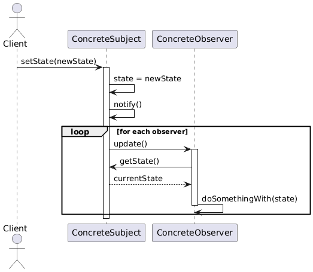

## Factory design pattern

Factory Method is a **creational** design pattern that provides an interface for creating objects in a superclass, 
but allows subclasses to alter the type of objects that will be created.
There are two variations of the factory design pattern. 
* Classic (ganf of 4)
* Simple Factory method which is more popular. Below is the architectural consideration


Builder is a **creational design pattern** that lets you construct complex objects step by step. 
The pattern allows you to produce different types and representations of an object using 
the same construction code.

* the client will only contact the factory to get the object of a concreate class
* in the factory class there will be a static method that will return the object of concreate class based on the input passed by the client
* There will be a switch/if-else in the factory method.
* Finally, **the client will never call the concreate classes methods. It only knows about the factory**

## Builder design pattern
The below uml is the combination of factory and builder.

```angular2html
+----------------+                                  +---------------------+
|    Director    |<>---------------------------->   |      Builder        | (Abstract)
+----------------+                                  +---------------------+
| - builder      |                                  | + buildFrame()      |
| + construct()  |                                  | + buildEngine()     |
+----------------+                                  | + buildExtras()     |
                                                    | + getResult(): Vehicle |
                                                     +---------------------+
                                                             ^
                                                             |
                                                     +---------------------+
                                                     | ConcreteBuilder     | (Abstract)
                                                     +---------------------+
                                                             ^
                                                             |
+-------------------+                                        |
| VehicleFactory <> |--------------------------------------->|                     
+----------------+  |                                        |
| + create_builder  |                                        |
(type: str): Builder|                                        |
+-------------------+                                        |
          |                            +----------------+   +----------------+   +----------------+
          |                            |   CarBuilder  |   |  BikeBuilder  |   |  ShipBuilder  |
          |                            +----------------+   +----------------+   +----------------+
          |                            | + buildFrame()|   | + buildFrame()|   | + buildFrame()|
          |                            | + buildEngine()|  | + buildEngine()|  | + buildEngine()|
          |                            | + buildExtras()|  | + buildExtras()|  | + buildExtras()|
          |                            | + getResult() |   | + getResult() |   | + getResult() |
          |                            +----------------+   +----------------+   +----------------+
          |                                     |                  |                  |
          v                                     v                  v                  v
+-----------------------------           +----------------+   +----------------+   +----------------+
|      Vehicle  | (Interface) |          |      Car       |   |      Bike      |   |      Ship      |
+-----------------------------|.         -----------------    ------------------   ------------------
| + get_details(): str        |          | - frame        |   | - frame        |   | - frame        |
|                             |          | - engine       |   | - engine       |   | - engine       |
|                             |          | - extras       |   | - extras       |   | - extras       |
|                             |          | + get_details()|   | + get_details()|  | + get_details() |
+----------------------------+           +----------------+   +----------------+   +----------------+
```

**As the number of components grows or their specificity varies across products 
(e.g., Car, Bike, Ship), cramming everything into build_extras() becomes 
messy and violates the Single Responsibility Principle. Making Director an abstract
class with concrete subclasses for each ConcreteBuilder is a solid approach to address
this—it allows each Director to tailor the construction process to its specific product’s needs**

```angular2html
+----------------+       +---------------------+
|    Director    | (Abstract)                |
+----------------+       +---------------------+
| - builder      |<>---->|      Builder        | (Abstract)
| + set_builder(builder: Builder)             |
| + construct(): Vehicle                      |
+----------------+       +---------------------+
          ^              | + buildFrame()      |
          |              | + buildEngine()     |
          |              | + getResult(): Vehicle |
          |              +---------------------+
          |                      ^
          |                      |
+----------------+   +----------------+   +----------------+
|   CarDirector  |   |  BikeDirector |   |  ShipDirector  |
+----------------+   +----------------+   +----------------+
| + construct()  |   | + construct()  |   | + construct()  |
+----------------+   +----------------+   +----------------+
          |                  |                  |
          v                  v                  v
+----------------+   +----------------+   +----------------+
|   CarBuilder  |   |  BikeBuilder  |   |  ShipBuilder  |
+----------------+   +----------------+   +----------------+
| + buildFrame()|   | + buildFrame()|   | + buildHull()  |
| + buildEngine()|  | + buildEngine()|  | + buildEngine()|
| + buildDoors()|   | + buildHandlebars()| + buildDeck()|
| + getResult() |   | + getResult() |   | + getResult() |
+----------------+   +----------------+   +----------------+
          |                  |                  |
          v                  v                  v
+----------------+   +----------------+   +----------------+
|      Vehicle  |<|--|      Car       |   |      Bike      |   |      Ship      |
| (Interface)   |    +----------------+   +----------------+   +----------------+
| + get_details()    | - frame        |   | - frame        |   | - hull         |
|                    | - engine       |   | - engine       |   | - engine       |
|                    | - doors        |   | - handlebars   |   | - deck         |
|                    | + get_details()|   | + get_details()|  | + get_details()|
+----------------+   +----------------+   +----------------+   +----------------+
```


## strategy design pattern

Below are the component part of SDP.

* Context: Holds a reference to a Strategy and delegates work to it.
* Strategy Interface: Defines the contract (e.g., execute()).
* Concrete Strategies: Implement specific behaviors.


i can also combine factory and strategy design patterns.

Factory: Decides what to create (e.g., which strategy object) without exposing creation logic.
Strategy: Defines how behavior is executed, allowing runtime swaps.


**below is the example**

Pianos: Factory creates piano types (P-145B, DP-32), 
        Strategy switches playing styles (classical vs. jazz).

## Observer design pattern

it is a behavioral design pattern in which an **OBJECT**(termed as Subject)  maintains a list of **DEPENDENTS**(termed as Observers) and notifies them
automatically when any state changes. It basically used to implement the pub sub or event driven use cases.
Use this design pattern when the change of state of an object needs to known by the other objects. 

so ideally, multiple publisher can be defined for a multiple system. Then we can have a subscriber which can be notified via multiple publisher.

## Key Components:
* Subject: Maintains a list of observers and notifies them of changes.
* Observer: Defines an interface for objects that receive updates from the subject.
* ConcreteSubject: Implements the subject with specific state and notification logic.
* ConcreteObserver: Implements the observer interface to react to updates.


```angular2html

+----------------+       +----------------+
|   Subject      |<----->|   Observer     |
+----------------+ 1    *+----------------+
| -observers     |       | +update()      |
| +attach()      |       +----------------+
| +detach()      |       
| +notify()      |       
+----------------+       
         ^                
         |                
+----------------+       
| ConcreteSubject|       
+----------------+       
| -state         |       
| +getState()    |       
| +setState()    |       
+----------------+       
         ^                
         |                
+----------------+       
| ConcreteObserver|       
+----------------+       
| -observerState  |       
| +update()       |       
+----------------+
```




## pipeline design pattern


## chain of responsibility
CoR is one of the behaviour design patterns where many handlers are created to handle a specific job.
In case of pipeline pattern, the whole pipeline should be run where all the steps are mandatory.
But in the case of CoR, the idea is to **Stops at first failure, reporting one error** 
So in case of authentication, if the first step is failed, the next steps of authentication should be peocessed.
Hence, this needs to be done via CoR.

Now I want to build a dataframe with multiple steps added, where all the steps should run. In that case,
its better to use pipeline pattern because all the steps need to run.


Practical Implications
* Pipeline: If your goal is to gather all validation errors (e.g., for a report to send back to a data provider), Pipeline fits because it runs every check. Example: "This record has a null age and an invalid email."
* CoR: If your goal is to fail fast (e.g., reject bad data in a streaming pipeline without further processing), CoR fits because it stops at the first issue. Example: "This record has a null age—discard it."


