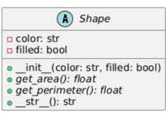
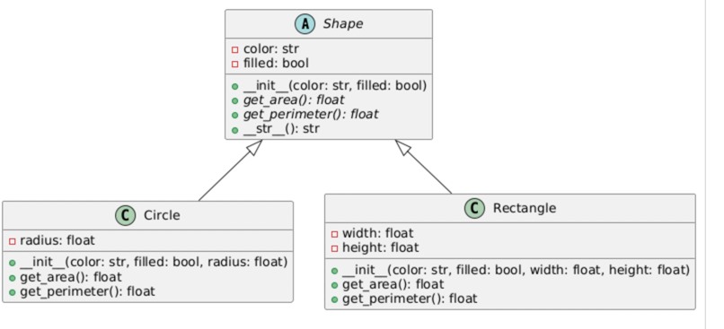
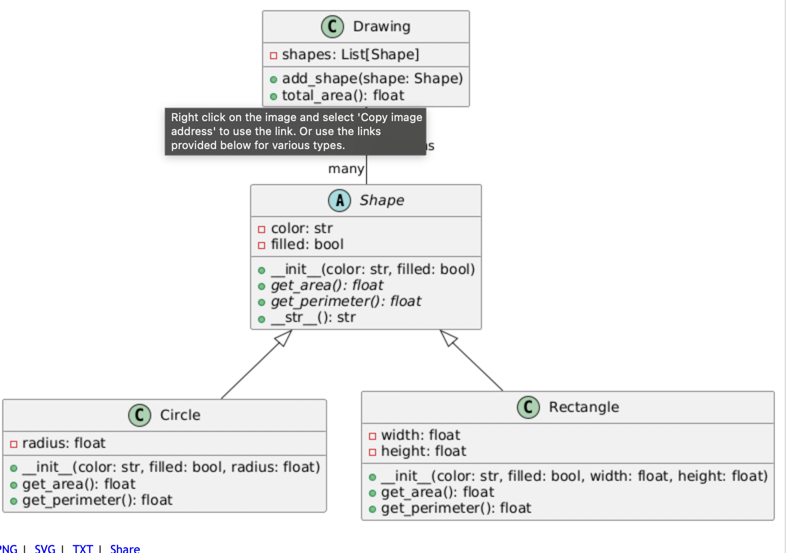
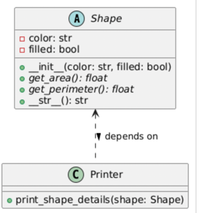

## What is an UML and how its good in design
To illustrate the structure of the design patterns, class diagram used.

## Class Diagram 
It denoted the **class information** like
a. Attributes
b. Operations (methods)




It also depicts the **class Relationships**
1. Generalizations
 This is parent child inheritance. For example
 
2. Association
Here one class can be associated with another class

## code example
```
from abc import ABC, abstractmethod
from typing import List
import math

# Abstract Shape Class
class Shape(ABC):
    def __init__(self, color: str, filled: bool):
        self.color = color
        self.filled = filled

    @abstractmethod
    def get_area(self) -> float:
        pass

    @abstractmethod
    def get_perimeter(self) -> float:
        pass

    def __str__(self) -> str:
        return f"Shape(color={self.color}, filled={self.filled})"

# Circle Class (inherits from Shape)
class Circle(Shape):
    def __init__(self, color: str, filled: bool, radius: float):
        super().__init__(color, filled)
        self.radius = radius

    def get_area(self) -> float:
        return math.pi * self.radius ** 2

    def get_perimeter(self) -> float:
        return 2 * math.pi * self.radius

    def __str__(self) -> str:
        return f"Circle(color={self.color}, filled={self.filled}, radius={self.radius})"

# Rectangle Class (inherits from Shape)
class Rectangle(Shape):
    def __init__(self, color: str, filled: bool, width: float, height: float):
        super().__init__(color, filled)
        self.width = width
        self.height = height

    def get_area(self) -> float:
        return self.width * self.height

    def get_perimeter(self) -> float:
        return 2 * (self.width + self.height)

    def __str__(self) -> str:
        return f"Rectangle(color={self.color}, filled={self.filled}, width={self.width}, height={self.height})"

# Drawing Class (associates with Shape)
class Drawing:
    def __init__(self):
        self.shapes: List[Shape] = []

    def add_shape(self, shape: Shape):
        self.shapes.append(shape)
        print(f"Added shape: {shape}")

    def total_area(self) -> float:
        return sum(shape.get_area() for shape in self.shapes)

# Example Usage
circle = Circle("Red", True, 5.0)
rectangle = Rectangle("Blue", False, 4.0, 6.0)

drawing = Drawing()
drawing.add_shape(circle)
drawing.add_shape(rectangle)

print(f"Total area of shapes in the drawing: {drawing.total_area()}")
```
Explanation: Here the Drawing Class associates with the Shape class. However there is no
relationship between both the classes.

Here the associated class can hold the objects of another class


3. Dependencies
A dependency is a relationship where one class (the client) relies on another class (the supplier) for some functionality

Below is the code example