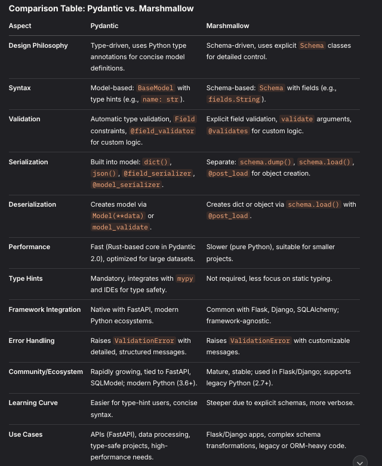

1. What validation can be performed. like httpsvalidations etc

2. Field validations
This is the default validations. There are many default validations present in Pydantic module
    gt: annotated_types.SupportsGt | None = _Unset,
    ge: annotated_types.SupportsGe | None = _Unset,
    lt: annotated_types.SupportsLt | None = _Unset,
    le: annotated_types.SupportsLe | None = _Unset,
In order to add more custom validations, @field_validator must be added to the class

3. model validations
These are validation based on multiple fields
```aiignore
    @model_validator(mode='after')
    def validate_mode(cls, value: 'Item'):
        if value.category == 'Electronics' and value.price < 1000:
            raise ValueError('price must be greater than 1000 for Electronics')
        return value
```
* Here the combine validations can be run object.
* Its is specific useful to validate relative fields. For example, user and password can be validated in a model.

4. Custom validations, 
These are the custom validations. APART FROM FIELD  validations defined while initialization of the class
```aiignore
    @field_validator('name')
    def validate_name(cls, value):
        if not re.match(f"[A-Za-z0-9]+$", value):
            raise ValueError('item_id must be alphanumeric')

        return value
```

5. nested models
```console
from pydantic import Field, field_validator, model_validator, HttpUrl, model_serializer, BaseModel
from enum import Enum


class AppEnvironment(Enum):
    development = "development"
    production = "production"
    qa = 'qa'


class DatabaseConfig(BaseModel):
    '''
     Database config model. It is based on the inouts.yaml
    '''
    host: str = Field(max_length=50)
    port: int = Field(ge=1, le=65535)
    name: str = Field(max_length=50)
    username: str = Field(max_length=50)


class APIModel(BaseModel):
    '''
    Model for APIs
    '''
    name: str = Field(max_length=50)
    url: HttpUrl
    enabled: bool


class APIConfig(BaseModel):
    app_name: str = Field(max_length=50)
    environment: AppEnvironment = Field(default=AppEnvironment.development)
    database: DatabaseConfig
    api_endpoints: list[APIModel]


```
This is an example of the nested models

6. serialization

Serialization in Pydantic refers to converting a model instance into a format like a Python dictionary or JSON (e.g., via model.dict() or model.json()). Unlike validation (which occurs when creating a model, e.g., Model(**data)), serialization happens when outputting the model. The components involved are:

Field: Defines metadata for serialization (e.g., aliases, exclusion) in the field declaration.
@field_serializer: Customizes serialization for a specific field with procedural logic.
```aiignore
class Product(BaseModel):
    price: float

    @field_serializer('price')
    def serialize_price(self, value: float, _info) -> str:
        return f"${value:.2f}"
```
@model_serializer: Customizes serialization for the entire model.
```aiignore
from pydantic import BaseModel, model_serializer

class Product(BaseModel):
    name: str
    price: float
    stock: int

    @model_serializer(mode='plain')
    def serialize_model(self) -> dict:
        return {
            "product": self.name,
            "cost": self.price,
            "available": self.stock > 0
        }
```

7. How its different to dataclasses
* dataclases are just the dat holding class. However, the validations can be added to dataclasses, but with pydantic they are already defined.
* dataclases are fast as compared to pydantic.

8. How its different from marshmallows


9. How it is different from argparse
Argparse is used to validate the cmd line params

10. In which order the validations will be executed. like Field, field_validator, model_validator
* Pre-Model Validation (@model_validator(mode="before"))
* Field Validation( TYPE CHECK--> FIELD--> CUSTOM)
* Post-Model Validation (@model_validator(mode="after"))
