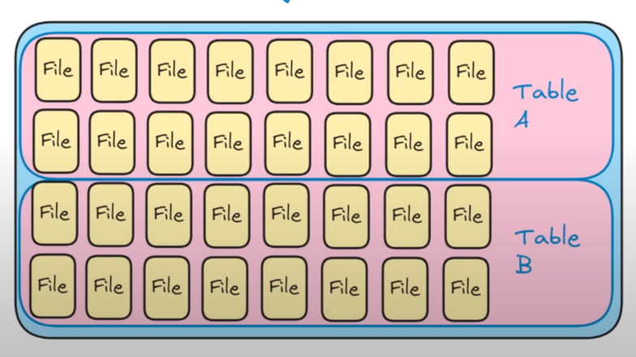
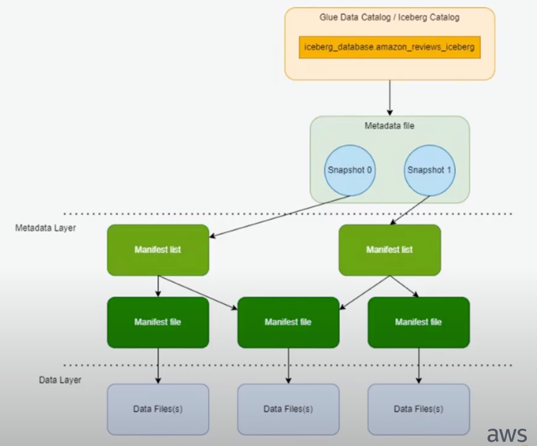
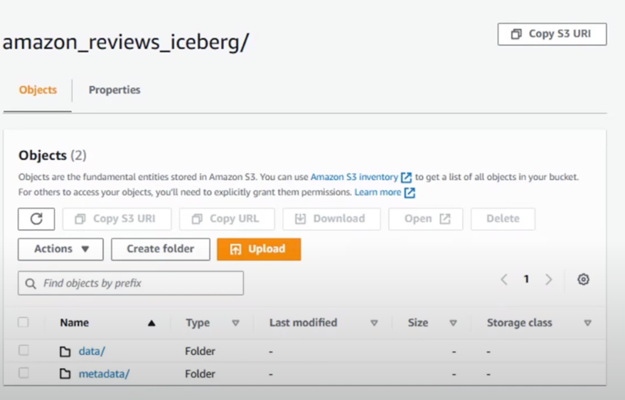

https://medium.com/learning-the-computers/pyiceberg-trying-out-the-sqlite-catalog-d7ace2a4ca5f

## resources to learn about Apache Iceberg

https://www.youtube.com/watch?v=SZDYmWIStUo

## what is Apache Iceberg

1. It id an open table format
   Table format is a way of structuring and organizing data within files in a data lake or data warehouse.
   

2. for huge analytic datasets
3. compatible with sql queries
4. types of engines supported by the iceberg- Spark, Trino, Flink, Hive

**everytime a data is written to a file, a new file is created. No updates or deletes are done on the existing files.
This is called immutable files.
Now everytime a new data is written, a snapshot is created that points to the new data files and old unchanged files

So an iceberg job is not only to store the data itself but to track while files belongs to which table.**

In short the iceberg has 2 layers

1. A metadata layer

a. metadata files
the metadate files contains the snapshot of the table at any point of time. It contains the pointer to the data files
that belongs to the table at that point of time.
It also contains the schema of the table and partitioning information

So in above picture the metadata contains the 2 snapshots.
Each metadata file points to the manifest lists.

b. manifest list

**manifest lis**t actually contains the snapshot of the table.
It contains the pointer to the manifest files. Now the list can have multiple manifest files

c. manifest files

It contains the list of actual data files.
It also contains the statistics of the data files like number of records, min and max values of each column etc.
Each manifest file can have multiple data files.

2. A data layer
   parquet or orc files

partitioning will applied to the data files

So above the table looks like in s3. It contains the metadata and data files

## what is copy on write

1. copy on write is a one of the way to handle updates and deletes in iceberg.
2. When a record is updated which is technically delete and insert, a new data file is created with the updated records
   and all the unchanged records from the old data file.
3. As a result the readers only see the new data files.
4. This is not recommend for frequent updates as everytime a the entire file is rewritten.
5. excellent read performance as the reader has to read only updated files from the manifest list.

## what is merge on read

This is another way to handle updates and deletes in iceberg.

1. Here the updates and deletes are stored in a files. These files are called **delta files.** .
2. Merge happens at the read time.
3. So, when a record is update or deleted, it the record is written to a delta file.
4. The rewrite of original files does not happen immediately.
5. While reading the data, reader needs to read both the original file and the delta files.
6. This is heavy on read performance as the reader has to read both original and delta files.
7. This is recommended for frequent updates and deletes. like cdc operations

## metadata bloat

the metadata bloat can occur at various levels in the iceberg metdata layer

1. metadata files--> each write on the table creates a new snapshot of the table.
2. manifest lists--> when a new metafiles created a new manifest list is created or updated
3. manifest files--> when a new data file is created a new manifest file is created
4. delta files--> when a new data file is created

At one point of time, these bloat needs to be cleaned up.

1. Expire old snapshots
2. Remove orphan files- delete the data or manifest files that are not pointed by any manifest list
3. Rewrite manifest-combines the small manifest files into a big one
4. compaction of data files- combines small data files into a big one
5. Control compaction retention

## what are the benefits of using iceberg

1. ACID transactions
   a. Deletion of records
   b. Update of records
2. Rollbacks and time travel
3. Hidden partitioning
4. Evolving schemas
   a. Add or remove columns
   b. Change column types
   c. Rename columns
   d. Reorder columns

## Iceberg supported file formats

## Iceberg Catalogs

### How are records are added to a table

when a record is added to the table, below things happen

1. A new data file is created in the data layer with the new records
2. A manifest file is created with the new data file. It contains the statistics of the data file
3. The manifest list is updated with the new manifest file and old manifest files
4. A new metadata file is crated with the new manifest list and old manifest lists

## Iceberg on AWS

## Iceberg with Spark

## Iceberg with pyiceberg lib in python