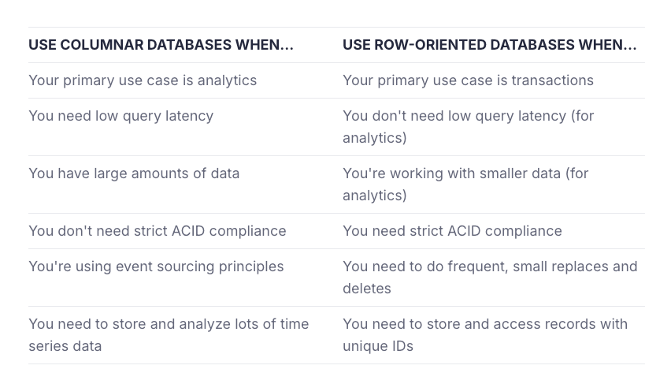

**The benefits of columnar databases become much more pronounced when working with large amounts of data, but you might want a columnar database even for small datasets (especially if you expect that data to grow).**

### **What are some examples of columnar databases?**

Popular examples of columnar databases include:

1. Amazon Redshift
2. Snowflake
3. Google BigQuery
4. ClickHouse
6. Apache Druid
7. Apache Pinot

### **What's the best columnar database?**

You know the answer: It depends. The choice of a columnar database depends on your goals, use case, and budget. 

Cloud data warehouses like AWS Redshift, BigQuery, and Snowflake are popular, powerful, and often more expensive than other options. They're good for business intelligence (BI) but not optimized for real-time analytics.

**Open source column-oriented databases like ClickHouse, Apache Pinot, and Apache Druid are powerful, flexible, and "free" (in theory), but can be very time-consuming to set up and maintain.**

Managed versions of open source columnar databases like Tinybird (ClickHouse) or DataStax (Cassandra) can be good options when your goal is to leverage the performance benefits of column-oriented storage without handling infrastructure.

Beyond performance and pricing, you should consider ease of use. Many different databases have features that are optimized for certain use cases. ClickHouse, for example, includes many custom SQL functions for working with web clickstream data, such as specialized datetime functions and URL parsing.