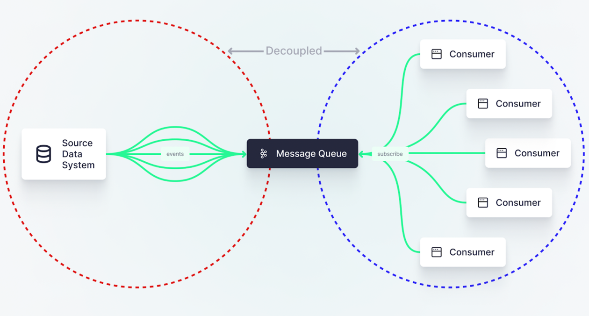

## The idea behind event-driven architecture is simple: Use events to trigger data ingestion processes.

1. As you navigate the challenges of big data and real-time analytics, Change **Data Capture (CDC) can be your friend.**
2. Next, consider whether the target system supports a real-time CDC stream natively. Most systems don't, though there are exceptions. Even if your target system does support CDC streams, you may still require an intermediary messaging queue like Kafka.
3. Kafka serves as a buffer to handle individual events, which can then be integrated into the target system. Kafka exposes a well-known protocol that has wide support in the data ecosystem, so it is more likely for this protocol to be supported by target systems.
4. Most application databases create a log of operations performed on the database. For some databases, this log is a core piece of the database’s architecture, such as Postgres’ Write Ahead Log (WAL). For others, it's a separate feature that needs to be enabled, like MySQL’s bin log. 
5. The log is an append-only file of database changes (e.g. inserts, updates, deletes) and their data. Every operation is appended as a new line in time order, meaning you can use the log to reconstruct the state of the database at an exact moment in time by simply starting at the top and replaying each event one by one.
6. Debezium that make it relatively simple to get up and running.
7. While reading the log file is lightweight, **it still requires an additional agent process on the server which does increase the load. It adds yet another layer of consideration when scaling the application database, as you must consider how increased traffic will affect the resources needed by this agent.**

## Event-driven architectures can be applied to file systems just as with databases.
 In many situations, you might actually receive data as files, either pushed from an internal service or even collected from an external data vendor.

1. In days gone by (actually, it’s still pretty common today), a data producer or broker would set up a large File Transfer Protocol (FTP) server and dump files onto a big storage server.
2. FTP is outdated and inflexible, yet it's still widely used today.
3. Times have changed, and now we have fault-tolerant, scalable, and cost-effective file storage services like Amazon S3 and Google Cloud Storage.
4. Files hosted in object storage on cloud vendors can leverage cloud-native notification services to notify downstream consumers of new or modified files.
5. Amazon, for example, has SQS and SNS which can be used to queue these events, and then you can attach any number of tools to respond to the event and handle the file. **For example, you could use Apache NiFi to handle S3 Event Notifications that are queued in SQS.**

## Message queues: Flexible, durable, and efficient

1. So, whether you’re working with databases or files as a source data system, you can adopt these new patterns for an event-driven architecture. Instead of polling your database or file store for changes, you can emit events instead.
2. But what should you do with those events? You have two options, really:

   a. Put events on a message queue or event-streaming platform, or 
 
   b. Have events trigger processes directly
8. In the event-driven patterns described above, I referred specifically to option #1. This is the preferred pattern, and the one chosen by most.
10. Why? The message queue is a durable, flexible, and efficient way to access data as it arrives. The beauty of the message queue is two-fold:
12. First, you solve the two problems that we started with by…
14. Decoupling downstream use cases from the source data system, and
15. Delivering data to consumers as soon as it's generated.
16. Second, most message queues allow for any number of downstream consumers to connect and subscribe to new messages. **So if 4 different teams building 8 different things want access to the data in 16 different ways they can each do their thing without disrupting each other.**

## So, could you skip the queue?

* Yes, you could skip the queue
* In some cases, you can have events trigger a process directly.
* For example, you can configure Amazon S3 to trigger an AWS Lambda function directly, allowing you to process the individual event immediately.
* You could replicate this model with other processing frameworks, like Apache NiFi or Apache Flink.
* For more simple use cases, you could skip the message queue and use a serverless function to immediately trigger a process based on updates in source file systems. 
* If you send events into SQS, for example, you can connect a bunch of different tools, e.g. Apache NiFi, Apache Flink, Striim, StreamSets, or your own code that lives on a small, cheap EC2 server, to process the event. If you instead send events directly to a Lambda, you don’t have this flexibility.

## To CONCLUDE

For databases, you can modify your backend code to emit events with your API calls before the database or choose Change Data Capture tools that watch database log files and emit events on changes after the database. For files, you can use cloud-native messaging services to emit events to a message queue or trigger processes directly with serverless functions.

