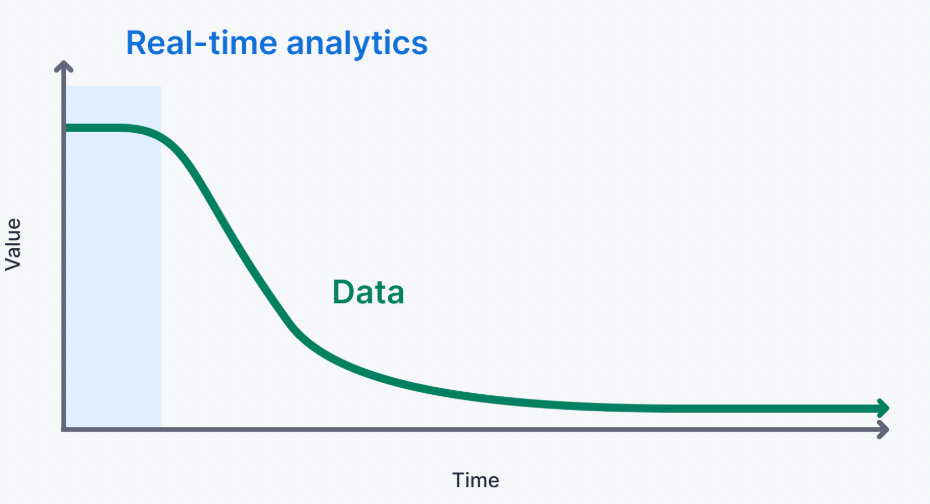

## What is Real time data analytics

1. Real-time analytics means spanning the entire data analytics journey, from capture to consumption, in seconds or less. 
2. Real time analytics uses real time data ingestion  followed by processing of data to **serve the operational intelligence and user facing analytics**.

### The features of realtime data analytics
1. Data freshness: Real time analytics systems capture the data at peak freshness. thats as sonnas its generated.
2. Low query latency: The latency of querying the data should respond in 50 milliseconds.
3. High query complexity : Real time analytics often involved the complex queries that can be executed on streaming data with the historical data.
4. Query concurrency: Many uses can access the real time analytics platform for different use cases.
5. Long data retention: Real time analytics retain the historical data for comparission and enrichments.

Where batch analytics mainly focuses on the  BI which generally involves the ETL or ELT processes. It serves the data visualizations and training of ML models.
In the case of real time analytics, it helps with the tangible, day to day , hour to hour , mins to mins decisions that materially impact how the business operates.

Where batch focuses on measuring the past to predict  or inform the future, real time analytics focuses on the present. 
It answers the questions like
a. Do we need to order or redistribute stock today?
b. Which offer should be shown to the customer right now?

#### Unlike batch analytics, real time analytics focuses on the following.
1. Real time data ingestion by capturing the using streaming platforms such as Kafka, Flink etc
2. Or by ingesting via event driven architecture like CDC from the RDBMS.
3. It leverages  the real time processing, incrementally updating analytics as new data is generated

### **Batch analytics is most commonly used for business intelligence, whereas real-time analytics is most commonly used for customer-facing data**

#### Real-Time Analytics vs Streaming Analytics

Streaming analytics systems dont leverage a full OLAP database which enables queries over arbitrary time spans.
Streaming alalytics systems do not support the joins for complex use cases, managed materialized views for roll ups.
It actually answers about a particular thing at a particular moment. Like DOES THIS PIECE OF DATA HAVE A IN IT? as data streams passes. Or is any anamoly is present in th stream of data? 

Realtime analytics system is designed to support
1. Long memory.
2. It very quickly ingests the data and **retains the historical data to answers the questions about current data in the context of historical events**
3. unlike the stream analytics **which uses stream processing for transformations, it uses OLAP engine that can handle comples analytics over unbounded windows.**

Use cases of real time analytics. Here is the more details. [real_time_analytics_usage](real_time_analytics_usage) 
1. Website analytics:

    Real-time analytics can help website owners monitor user behavior as it happens, enabling them to make data-driven decisions that can improve user engagement and conversion rates even during active sessions. (related: https://www.tinybird.co/blog-posts/ecommerce-google-analytics-alternative)
2. Personalization

    real-time analytics can help companies personalize user experiences as a customer is using a product or service, based on up-to-the-second user behavior, preferences, history, cohort analysis. https://www.tinybird.co/blog-posts/real-time-personalization
3. User-facing analytics

    Real-time analytics can give product owners the power to inform their end users with up-to-date and relevant metrics related to product usage and adoption, which can help users understand the value of the product and reduce churn.https://www.tinybird.co/blog-posts/user-facing-analytics
4. Operational intelligence

   Real-time analytics can help companies monitor and optimize operational performance, enabling them to detect and remediate issues the moment they happen and improve overall efficiency. https://matics.live/blog/real-time-operational-intelligence/
5. Anomaly detection and alerts.

    Real-time analytics can be used to detect real-time anomalies, for example from Internet of Things (IoT) sensors, and not only trigger alerts but build self-healing infrastructure
6. Usage-based pricing. 

   Real-time analytics can help companies implement usage-based pricing models, enabling them to offer personalized pricing based on real-time usage data. 
7. Customer 360s.

   Real-time analytics can help companies build a comprehensive and up-to-date view of their customers, enabling them to offer personalized experiences and improve customer satisfaction.

### Challenges with real-time analytics

Building a real-time analytics system can feel daunting. In particular, seven challenges arise when making the shift from batch to real-time:

1. Using the right tools for the job: 
   Instead of data warehouses, batch ETLs, DAGs, and OLTP or document-store app databases, engineers building real-time analytics need to use streaming technologies, real-time databases, and API layers effectively.
2. Adopting a real-time mindset:  Batch processing (and batch tooling like dbt or Airflow) often involves regularly running the same query to constantly recalculate certain results based on new data. In effect, much of the same data gets processed many times. 

   But if you need to have access to those results in real-time (or over fresh data), that way of thinking does not help you.

   A real-time mindset focuses on minimizing data processing - optimizing to process raw data only once - to both improve performance and keep costs low.
4. Handling scale:real-time applications must be able to handle and process ingestion peaks in real-time. Consider an eCommerce store on Black Friday. To support use cases like real-time personalization during traffic surges, your real-time infrastructure must respond to and scale with massive data spikes.
5. Enabling real-time observability:  Failures in real-time infrastructure happen fast. Detecting and remediating scenarios that can negatively impact production requires real-time observability that can keep up with real-time infrastructure.
6. Evolving data projects in production
7. Controlling costs:  Real-time analytics demands new tools, new ways of working, increased collaboration, added scale, and complex deployment models. These factors introduce new dependencies and requirements that, depending on your design, can create serious cost sinks.

**A.** Use the right tools for real-time analytics. It can be tempting to try to leverage existing infrastructure, especially cloud data warehouses, for real-time analytics. But this is a classic "square peg, round hole" situation that will prove costly. Data warehouses are not optimized for real-time analytics, and attempting to make them so generally results in very high cloud compute costs.**
 Instead, offload real-time analytics workloads to real-time data platforms optimized for real-time analytics. These platforms are specifically designed and specified for handling real-time analytics at scale.

**B.** Follow SQL best practices. The popularity of SQL and the rise of Big Data have made it possible for people with a modicum of data experience to make ad hoc queries to a company's data warehouse for answers to pressing questions.

 In theory, the consequences of unoptimized queries are mitigated when the query is only being run infrequently.

 With real-time analytics, however, SQL-defined data transformations will run continually, perhaps millions of times per day. Unoptimized SQL queries will balloon costs with real-time analytics if only because those queries will be run considerably more often. Follow these SQL best practices to make sure your queries are optimized for real-time analytics. 

**C.** Consider managed infrastructure. Real-time analytics carries a learning curve. It requires new skills and new ways of thinking.
Competent, qualified data professionals who can manage real-time data at scale are scarce in today's market. Rather than hire expensive resources to try to manage new tools and infrastructure, consider using managed, well-integrated infrastructure that can support your real-time analytics use cases from end to end.

**D.** Choose modern tools. If you're still trying to use Hadoop or Snowflake for real-time analytics, you're behind. New technologies are emerging that make real-time analytics easier to develop. Choose real-time databases, real-time data platforms, and other modern tools that increase your chance of success with real-time analytics.
