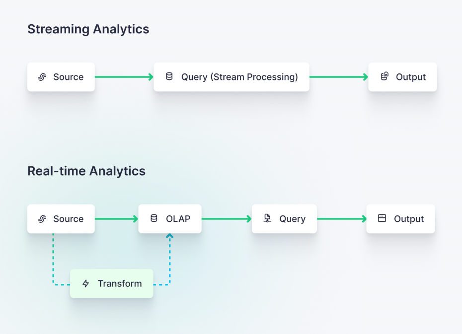

## What is Real time data analytics

1. Real-time analytics means spanning the entire data analytics journey, from capture to consumption, in seconds or less. 
2. Real time analytics uses real time data ingestion  followed by processing of data to **serve the operational intelligence and user facing analytics**.

### The features of realtime data analytics
1. Data freshness: Real time analytics systems capture the data at peak freshness. thats as sonnas its generated.
2. Low query latency: The latency of querying the data should respond in 50 milliseconds.
3. High query complexity : Real time analytics often involved the complex queries that can be executed on streaming data with the historical data.
4. Query concurrency: Many uses can access the real time analytics platform for different use cases.
5. Long data retention: Real time analytics retain the historical data for comparission and enrichments.

Where batch analytics mainly focuses on the  BI which generally involves the ETL or ELT processes. It serves the data visualizations and training of ML models.
In the case of real time analytics, it helps with the tangible, day to day , hour to hour , mins to mins decisions that materially impact how the business operates.

Where batch focuses on measuring the past to predict  or inform the future, real time analytics focuses on the present. 
It answers the questions like
a. Do we need to order or redistribute stock today?
b. Which offer should be shown to the customer right now?

#### Unlike batch analytics, real time analytics focuses on the following.
1. Real time data ingestion by capturing the using streaming platforms such as Kafka, Flink etc
2. Or by ingesting via event driven architecture like CDC from the RDBMS.
3. It leverages  the real time processing, incrementally updating analytics as new data is generated

### **Batch analytics is most commonly used for business intelligence, whereas real-time analytics is most commonly used for customer-facing data**

#### Real-Time Analytics vs Streaming Analytics

Streaming analytics systems dont leverage a full OLAP database which enables queries over arbitrary time spans.
Streaming alalytics systems do not support the joins for complex use cases, managed materialized views for roll ups.
It actually answers about a particular thing at a particular moment. Like DOES THIS PIECE OF DATA HAVE A IN IT? as data streams passes. Or is any anamoly is present in th stream of data? 

Realtime analytics system is designed to support
1. Long memory.
2. It very quickly ingests the data and **retains the historical data to answers the questions about current data in the context of historical events**
3. unlike the stream analytics **which uses stream processing for transformations, it uses OLAP engine that can handle comples analytics over unbounded windows.**

Use cases of real time analytics
1. Website analytics:

    Real-time analytics can help website owners monitor user behavior as it happens, enabling them to make data-driven decisions that can improve user engagement and conversion rates even during active sessions. (related: https://www.tinybird.co/blog-posts/ecommerce-google-analytics-alternative)
2. Personalization

    real-time analytics can help companies personalize user experiences as a customer is using a product or service, based on up-to-the-second user behavior, preferences, history, cohort analysis. https://www.tinybird.co/blog-posts/real-time-personalization
3. User-facing analytics

    Real-time analytics can give product owners the power to inform their end users with up-to-date and relevant metrics related to product usage and adoption, which can help users understand the value of the product and reduce churn.https://www.tinybird.co/blog-posts/user-facing-analytics