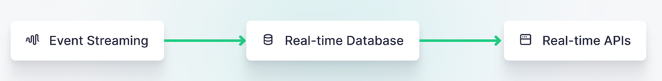

# Real-time analytics tools and architecture

real time analytics architecture consists for below 2 components.
1. Data streaming technologies.
2. Real-time databases
3. Real-time APIs

## Data streaming technologies.
Event driven architecture drives the concept of datastream technologies. Since real time analytics requires high-frequency of data, a reliable way is required to capture 
the data from the source and or by the applications generating the real time events.
The most commonly used data streaming technology is Apache Kafka, an open-source distributed event streaming platform used by many.
While Kafka and its offshoots are broadly favored in this space, a few alternatives have been widely adopted, for example:

* Google Pub/Sub
* Amazon Kinesis
* RabbitMQ

[event_driven_architecture_dabases_and_files.md](event_driven_architecture_dabases_and_files.md) 

## Real-time databases.

1. Real-time analytics architectures tend to include a columnar real-time database that can store incoming and historical events data and make it available for low-latency querying.

2. Real-time databases should offer high throughput on inserts, columnar storage for compression and low-latency reads, and functional integrations with publication layers.

3. Critically, most standard transactional and document-store databases are not suitable for real-time analytics, so a column-oriented OLAP should be the database of choice.

* ClickHouse
* Druid
* Pinot

Link to columnar databses- [columnar_databases.md](columnar_databases.md)
Link to realtime databases - [real_time_analytics_db.md](real_time_analytics_db.md)

**Real-time databases are built for high-frequency inserts, complex analytics over large amounts of data, and low-latency querying.**

## Real-time API layers

To make use of data that has been stored in real-time databases, developers need a publication layer to expose queries made on that database to external applications, services, or real-time data visualizations. This often takes the form of an ORM or an API framework.

Publication layers for real-time data analytics generally require that you build your own custom backend to meet the needs of your application. This means building yet another HTTP API using tools like:

* FastAPI (Python)
* Express.js (JavaScript)
* Hyper (Rust)
* Gin (Go)

## Real-time streaming data architectures that scale