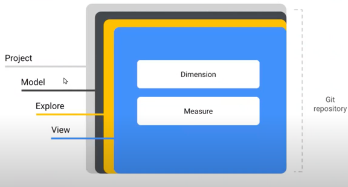

1. Below are the two main concepts in visualizations

a. Dimensions- It like a table column. 
b. Measures- its like the calculations which actually serves the KPIs.
Any visualization is made with  dimensions and the measures.
Here is example in case of looker
