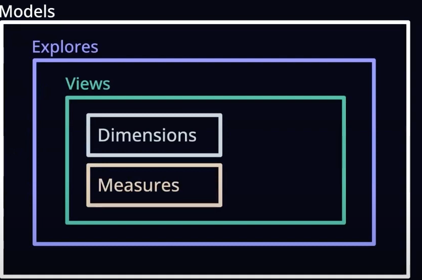
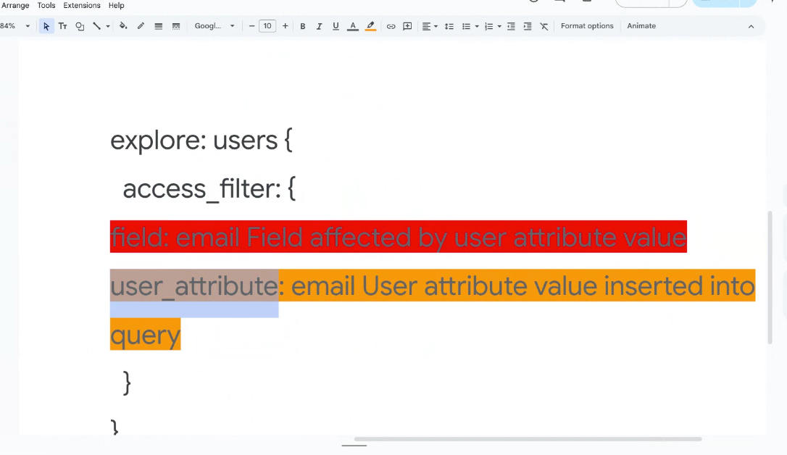

# types of controls and permissions

the permission can be set at the various levels on the looker objcets


# Looker permission mgmt

1. users
2. roles- permissions sets + model sets
* default roles
  a. Admin
  b. Developer
  c. User
  d. Viewer
* custom roles
3. group
*  The best way ie to attach the users to the groups and define the roles at the group level
* the users can be mapped to the okta groups or google groups
* 
4. connections
5. user attributes
* it lets us customize the looker experience on a user-by-user basis.
* They cn be used in many places like
  a. Db connections
  b. Filters
  c. access grants
  d. liquid in lookml

## Explanation
Follow the below to create a user attribute
https://cloud.google.com/looker/docs/admin-panel-users-user-attributes

## at explore level
1. Created a user attribute
2. assign the value at the group level

3. add the filter at the explore level
```angular2html
explore: offices {
  always_filter: {
    filters: [offices.state: "{{ _user_attributes['dsav_1818_poc_user_attribute_state'] }}"]
  }

}
```
output- the filter will be added
```angular2html
SELECT
    offices.state  AS offices_state,
    offices.employee_id  AS offices_employee_id,
    offices.city  AS offices_city
FROM `dsav_1811_poc.offices`  AS offices
WHERE (offices.state ) = 'Utrecht'
GROUP BY
    1,
    2,
    3
ORDER BY
    1
LIMIT 500
```

## at dimension level


6. permission sets - what users are allowed to do
7. model sets  - what models on which the user can do it

# how to integrate the okta with the looker groups
1. Here the roles can be attached to the groups
2. Now people can be mapped to the groups via okta groups

## but how to map the okta to looker groups

Question: whether to have the okta or google group to manage the looker groups


# looker authentications and authorizations

1. okta integration


# permission at the lookml level
1. filters
2.  access filters
3. other filters

# how to set the permission at the project level?


# how to set the permissions at the model levels

# permissions at views level

# permissions at the dimensions and measures level.


# row level access in bq

1. by service account

2. Vis using oauth
Best way either by SA(lookml models) or oauth


