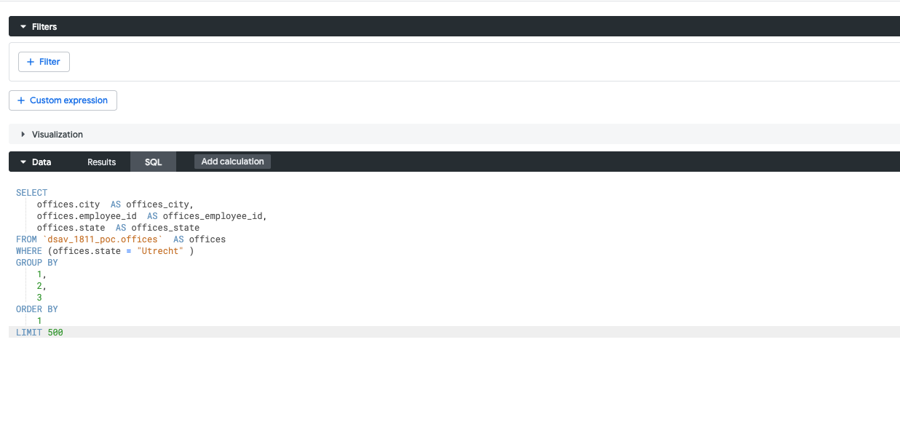

# types of controls and permissions

resource- https://www.spectacles.dev/blog/looker-permissions-security-groups-roles-and-access-grants-explained

the permission can be set at the various levels on the looker objects


# Looker permission mgmt

1. users
2. roles- permissions sets + model sets
* default roles
  a. Admin
  b. Developer
  c. User
  d. Viewer
* custom roles
3. group
*  The best way ie to attach the users to the groups and define the roles at the group level
* the users can be mapped to the okta groups or google groups
* 
4. connections
5. user attributes
* it lets us customize the looker experience on a user-by-user basis.
* They can be used in many places like

  a. Db connections

  b. Filters

  c. access grants

  d. liquid in lookml

## Explanation
Follow the below to create a user attribute
https://cloud.google.com/looker/docs/admin-panel-users-user-attributes

## at explore level
1. Created a user attribute
2. assign the value at the group level

3. add the filter at the explore level
```angular2html
explore: offices {
  always_filter: {
    filters: [offices.state: "{{ _user_attributes['dsav_1818_poc_user_attribute_state'] }}"]
  }

}
```
output - the filter will be added
```angular2html
SELECT
    offices.state  AS offices_state,
    offices.employee_id  AS offices_employee_id,
    offices.city  AS offices_city
FROM `dsav_1811_poc.offices`  AS offices
WHERE (offices.state ) = 'Utrecht'
GROUP BY
    1,
    2,
    3
ORDER BY
    1
LIMIT 500
```

Important - always_filter can be modified by the user but access_filter cant be modified.


## at dimension level

now if i add the attribute to the dim level like below
```angular2html
  dimension: state {
    type: string
    # sql: ${TABLE}.state ;;
    sql: '{{ _user_attributes['dsav_1818_poc_user_attribute_state'] }}' ;;
```
Now the default value will come for this dimension. The default value will be set at the user attribute.


## Db connections

**NOT VERY SURE. HOW TO USE THIS**

## at the lookml level
a. Access grants
* 
below is the sample access_grants which should be defined in the model files
```angular2html
access_grants :is_employee_emae {
    user_attribute : region
    allowed_values: ['EMEA']
}
explore: order {
    required_access_grants" [is_employee_emae]
    fields: [ALL_FIELDS*]
    from: fact_order
}
```

explanation:
Now the explore will provide all the fields from the fact_order table only if `required_access_grants` is true for EMEA
`required_acess_grants` is a list which can have multiple values

**The best eay to manage the access_grants is to create a file with all the access_grants rules and import into the model files like for dims or measures**

b. access_filters

*  This ia another level of filter can be used for **ROW LEVEL security.**
```explore: offices {
  access_filter: {
    field: offices.state
    user_attribute: dsav_1818_poc_user_attribute_state
  }
}
```

Now the same offices example, the fiklter is empty and user cant edit the filter 
* 
other filter can also be added. **But default filter cant be removed**


explanation: Here the filter is applied to the field state. It will only select the rows for the 
state = 'user_attribute_values' defined for the user

c. Other filters
* sql_always_where
```
explore: offices {
  sql_always_where:
  ${offices.state} = "{{ _user_attributes['dsav_1818_poc_user_attribute_state'] }}" ;;

}
```


* sql_always_having


## best practices

*  Use explore filters (always_filter, sql_always_where) for dataset-wide restrictions.
* Use dimensions for user-friendly filters (e.g., Yes/No fields).
* Use measures filters for conditional aggregations (e.g., summing only active sales).
* If the filter is for security (users must not override), use sql_always_where or access_filter.


6. permission sets - what users are allowed to do
7. model sets  - what models on which the user can do it

**ROLES = PERMISSION ETS + MODEL SETS**
when a cuatome role is created in the looker, below thigs occur
a. A permission set needs toi be defined. It represents the actions which can be perfomed on the  models files
b. model sets - which models sets the permission needs to be assigned. 
c. And finally, which groups the role should be assigned.


# how to integrate the okta with the looker groups
1. Here the roles can be attached to the groups
2. Now people can be mapped to the groups via okta groups

## but how to map the okta to looker groups

Question: whether to have the okta or google group to manage the looker groups


# looker authentications and authorizations

1. okta integration


# permission at the lookml level
1. filters 
2. access gran
2. access filters
3. other filters

# how to set the permission at the project level?


# how to set the permissions at the model levels

# permissions at views level

# permissions at the dimensions and measures level.


# row level access in bq

1. by service account

2. Vis using oauth
Best way either by SA(lookml models) or oauth


