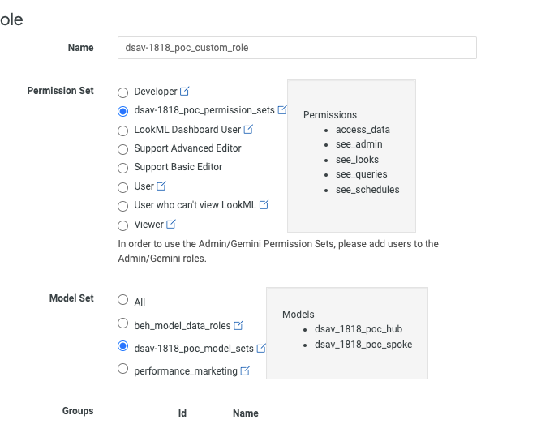

# The same data is projected for the below options.

# Table 

1. In edit there are important options
* Show total as toggle bar - it will show the total value of the measure. But totals needs to be enabled in the data panel.
* Transpose: this will transpose the columns and rows. If total is selected this may not work.
* Limit displayed rows: hpw many rows want to displayed in the chart/table. It will not make any significance change in the data panel. 

#### Below is the example of the table option.

# Column chart
1. This is the column based visualizations.

#### Below is the example of the column chart.

# Bar charts.
##### It is the same as column charts.
Just the change is rows oriented.

### Custom fields