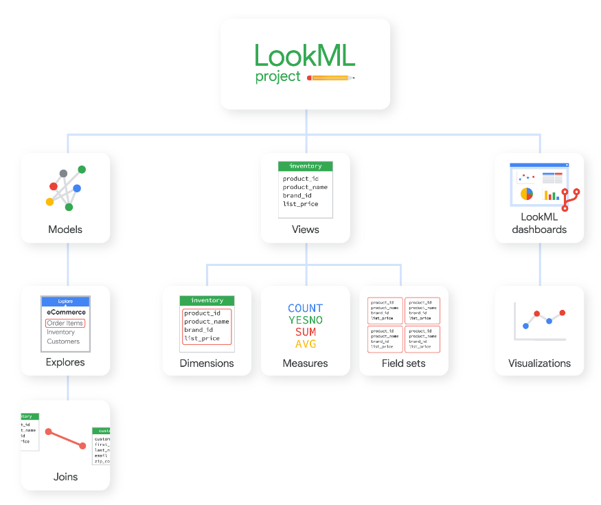
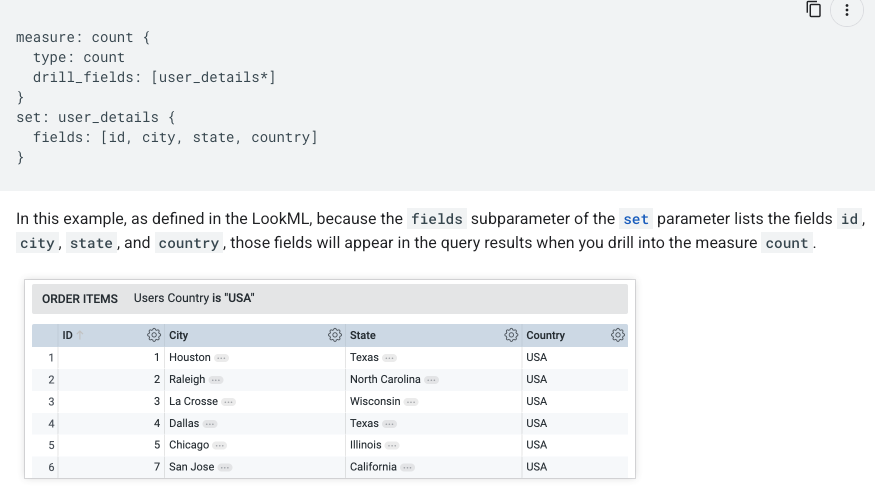
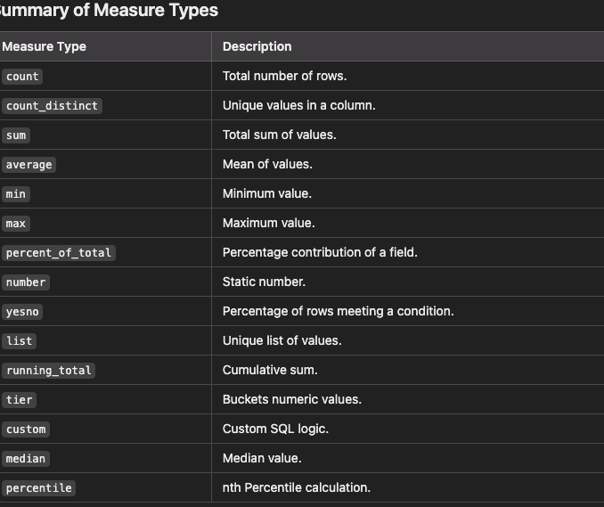
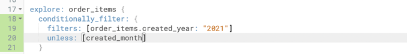
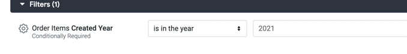
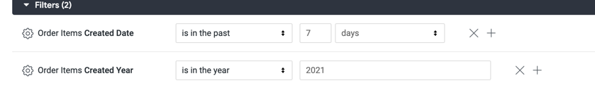

1. LookMl helps in create custom data models.

* So one can create a model using lookml and it will translated to the sql query.
* It is language for describing measures, calculations, aggregations and relationships in the sql 
* It creates an abstraction between the db and the user.
* It defines like how to join the tables, create a custom table or logic of the fields.
2. How it can be useful for the non-tech people?
Answer:

Below are the elements of the lookml.


The lowest level if lookml is **FIELDS**

* the fields are same as dimension(column of the table) and measures(aggregate functions on the column). 

Next come as **VIEWS** which are the second level of elements in the lookml.
* The view represents a table in the database.
* it contains the dimensions and measures.
* any custom dimensions or measures can be defined in the view. Below is one of the example.
```angular2html
dimension: full_name {
    type:string,
    sql: ${first_name} || ' ' || ${last_name}
}
```
Next level in lookml structure is **EXPLORE**
Explore is the way to explore the views. Its a combinations if one of more views.
**The joining of tables or views are done in the explore.**
```angular2html
explore: orders {
  label: "Order Details"
  description: "Explore the details of customer orders."

  join: customers {
    sql_on: ${orders.customer_id} = ${customers.id} ;;
    type: left_outer
    relationship: many_to_one
  }

  join: products {
    sql_on: ${orders.product_id} = ${products.id} ;;
    type: left_outer
    relationship: many_to_one
  }

  field: total_revenue {
    type: number
    sql: ${orders.total_amount} ;;
    label: "Total Revenue"
    description: "The total revenue generated by the order."
  }

  field: order_count {
    type: count
    label: "Order Count"
    description: "The number of orders placed."
  }

  always_filter: {
    filters: [ 
      {
        field: orders.status
        value: "active"
      }
    ]
  }

  access_filter: {
    field: users.region
    user_attribute: user_region
  }
}
```


To use the explore we need a **model** which is a next level.
Models uses the explore to create the joins of views.

```angular2html
# This is a LookML model file
connection: "my_database_connection" -- connection to use to query the data in the tables

include: "/views/*.view.lkml"

explore: orders {
  label: "Order Details"
  description: "Explore the details of customer orders."

  join: customers {
    sql_on: ${orders.customer_id} = ${customers.id} ;;
    type: left_outer
    relationship: many_to_one
  }

  join: products {
    sql_on: ${orders.product_id} = ${products.id} ;;
    type: left_outer
    relationship: many_to_one
  }

  field: total_revenue {
    type: number
    sql: ${orders.total_amount} ;;
    label: "Total Revenue"
    description: "The total revenue generated by the order."
  }

  field: order_count {
    type: count
    label: "Order Count"
    description: "The number of orders placed."
  }

  always_filter: {
    filters: [ 
      {
        field: orders.status
        value: "active"
      }
    ]
  }

  access_filter: {
    field: users.region
    user_attribute: user_region
  }
}

explore :products { }

explore: orders { }

explore: user_order_facts { }


```

And the highest level is **PROJECT.**
all the model or views files relies in onr project. Just like a git repo.

dimension and dimension_group in view file
In LookML, a dimension group is a way to define multiple related dimensions at once, 
typically for date or time fields. It groups these related dimensions under a single field and 
generates additional dimensions automatically, such as day, week, month, year, etc., based on the data type 
and granularity of the field.
```angular2html
dimension_group: created_at {
  type: time
  timeframes: [raw, date, week, month, quarter, year]
  sql: ${TABLE}.created_at ;;
  datatype: timestamp
  convert_tz: yes
  description: "The creation timestamp of the record."
}

```
the deimensions and measures are defined in the view file of the project.


# DIMENSIONS TYPES

1. string
2. number
```angular2html
dimension: longitude {
    type: number:
    sql: ${TABLE}.longitude ;;
}
dimension: latitude {
    type: number:
    sql: ${TABLE}.latitude ;;
}
```
3. yesno
4. tier --> create the range. Something like range partition in bq
5. location -- it requires the lat/long values
```angular2html
dimension: location {
    type: location
    sql_latitude: ${latitude} ;;   -- this means the dimension is already defined in the view.
    sql_longitude: ${lomgigute} ;;
}
```
6. distance - calculate the distance between 2 points
```angular2html
dimension: longitude {
    type: number:
    sql: ${TABLE}.longitude ;;
}
dimension: latitude {
    type: number:
    sql: ${TABLE}.latitude ;;
}

dimension: distance_from_restaurant_by_user_order_location {
    type: distance
    start_location_field: restauranr_view.location -- here the location is a dimension defined in restaurant view of type location
    end_location_field: users_view.location
    units: miles
}

```
7. zipcode -- specify the zipcode


What is **drill_fields** while creating the measure
```
measure: count {
    type: count
    drill_fields: [id, name, distribution_centers.name, distribution_centers.id, inventory_items.count]
  }```
```
So drill fields are something which can be expanded more granually. So its just like adding a column in count with ading in the group by clause.




# creating a custom dimension
```
dimension: deliver_days {
    type:  number
    sql: date_diff(${created_date}, ${delivered_date},day);;
  }
```

# creating a custom measure
```angular2html

```
Below are the type of measures which can be defined as `type` while creating custom measures in lookml.




# how to add a filter in the lookml models?
To add the filters in the dashboard, we need to add in the models file.
1. **always_filter** this is the default filter which can be created in the backend. 
The users can change the filter in the dashboard as well eventhough its defined in the lookml file.
```angular2html
 always_filter: {
    filters: [order_items.status: "Cancelled"]
  }
```
2. sql_always_where

```angular2html
sql_always_where: ${created_date}>='2021-01-01' ;;
```
The filter will not be created as the default filter and hence users will not be able to see the filter.
**Hence, this filter is a little bit dangerous to apply and ideally should not be put**
    
3. sql_always_having
this is same as having clause in sql

```angular2html
    sql_always_having: ${order_item_count}>1 ;;  -- here the order_item_count is denoted as count(*) where ad order_tem is the name of the view
```
The sql under the hood will be   `` HAVING (COUNT(*))>1 ``


# Conditional filter in models
If I added the below filter 

then, the filter will be applied on to explore.

If I add month to the filter, then the conditionally will be removed.



# Joins in lookml.
with joins we can create the models in lookml.

```
explore: order_items {

  join: inventory_items {
    type: left_outer
    sql_on:  ${order_items.inventory_item_id} = ${inventory_items.id};;
    relationship: many_to_one
  }

  join: products {
    type: left_outer
    sql_on: ${inventory_items.product_id} = ${products.id}  AND ${products.id}>500;;
    fields: [products.brand, products.category, products.department]
  }

  join: users {
    type: left_outer
    sql_on: ${order_items.user_id} = ${users.id} ;;
  }

}
```

lookml supports all the main sql join


# Some advanced features of the lookml

#### 1. Datagroups
a. It is used to define the caching policy.
```
datagroup: default {
  sql_trigger: select 1 ;;
  max_cache_age: "24 hours"
}

persist_with: default

```
b. The best way to define the data group is on the model file rather as a seprate file. 
```
connection: "bigquery_public_data_looker"

# include all the views
include: "/views/*.view"
include: "/z_tests/*.lkml"
include: "/**/*.dashboard"

datagroup: training_ecommerce_default_datagroup {  --name of the datagroup
  # sql_trigger: SELECT MAX(id) FROM etl_log;;     -- The query will be run in periodic basis to check if the data has been updated in the table which will lead to refresh the cache
  max_cache_age: "1 hour"                           -- amount of time the data will be fetched from the cache rather than bq
}
```

**A datagroup cannot have both sql_trigger and interval_trigger parameters. If you define a datagroup with both parameters, the datagroup will use the interval_trigger value and ignore the sql_trigger value, since the sql_trigger parameter requires using database resources when querying the database.**

**Question: When the cache will be refreshed in case the data has been updated.
Is is after the `max_cache_age` expires or when looker see the that the data has been changed?**

Answer: 


Below is an example to define custom data_groups for explores.
```
connection: "bigquery_public_data_looker"

# include all the views
include: "/views/*.view"
include: "/z_tests/*.lkml"
include: "/**/*.dashboard"

#DEFINE CUSTOM DATAGROUP 
datagroup: training_ecommerce_default_datagroup {
  sql_trigger: SELECT 1;;
  max_cache_age: "1 hour"
}

#DEFINE ANOTHER CUSTOM DATAGROUP 
datagroup: another_datagroup {
  sql_trigger: SELECT 1;;
  max_cache_age: "5 hour"
}

label: "E-Commerce Training"

explore: products {
  persist_with: training_ecommerce_default_datagroup  # HERE THE DATA_GROUP CAN BE USED FOR CACHING 
  group_label: "products"
}
explore: order_items {
  persist_with: another_datagroup   # HERE THE DATA_GROUP CAN BE USED FOR CACHING
  group_label: "order_items"
  join: users {
    type: left_outer
    sql_on: ${order_items.user_id} = ${users.id} ;;
    relationship: many_to_one
  }

  join: inventory_items {

    type: left_outer
    sql_on: ${order_items.inventory_item_id} = ${inventory_items.id} ;;
    relationship: many_to_one
  }

  join: products {
    type: left_outer
    sql_on: ${inventory_items.product_id} = ${products.id} ;;
    relationship: many_to_one
  }

  join: distribution_centers {
    type: left_outer
    sql_on: ${products.distribution_center_id} = ${distribution_centers.id} ;;
    relationship: many_to_one
  }
}

explore: events {
  join: event_session_facts {
    type: left_outer
    sql_on: ${events.session_id} = ${event_session_facts.session_id} ;;
    relationship: many_to_one
  }
  join: event_session_funnel {
    type: left_outer
    sql_on: ${events.session_id} = ${event_session_funnel.session_id} ;;
    relationship: many_to_one
  }
  join: users {
    type: left_outer
    sql_on: ${events.user_id} = ${users.id} ;;
    relationship: many_to_one
  }
}

```

**_Note: The caching policy is defined for the whole explore._**


