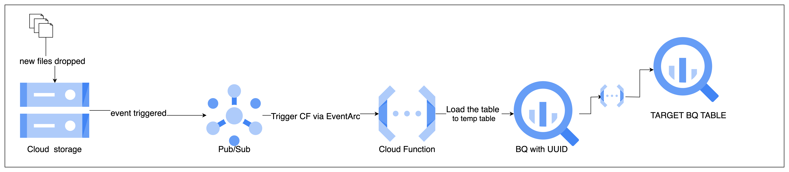

## Initial setup. 
1. create the gcp authentication with strategy pattern 

2. create the plugins folder with gcs and bq

3. create a strategy pattern to read the file in various file format

4. create dags and sql folder

5. create utils for other stuff like loading the file

## airflow part

1. change the static country as yaml file
2. Create a dynamic dag creation for every continent
3. Load the incremental files from gcs to bq with auto schema inference
4. create the task group for every country present in the static file
5. Create target table for every country
6. insert the incremental data to the main table with type casting
7. run the aggregation query and store the results to the main table

## Architecture change.
1. for every file placed, its better to have a notification to pubsub with file details
2. the dag scheduled to pick up the message from the pubsub and load the data to temprory table
